# **OpenDirect (OOH) 1.5.1 v1.1**

An OpenDirect 1.5.1 Implementation for the Out-Of-Home Industry

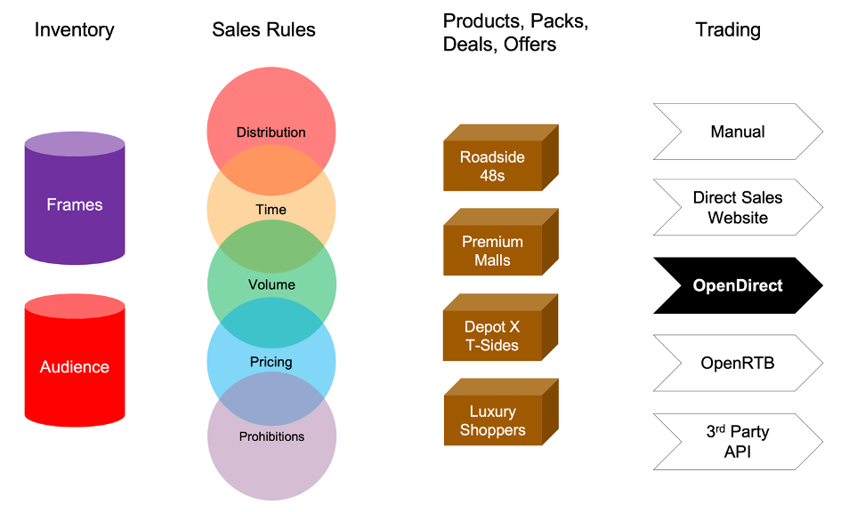

# OpenDirect 1.5.1

The OpenDirect media trading API was devised by the OpenDirect Working Group, a working group within the IAB Technology Lab. Further details about the IAB Technology Lab can be found at: https://iabtechlab.com/working-groups/opendirect-working-group/

# OpenDirect (OOH) 1.5.1

OpenDirect (OOH) is an extension of the OpenDirect schema, particularly around the &#39;Product Target&#39; function, to accommodate the unique aspects of the &#39;real world&#39; Out-Of-Home Media (OOH) inventory in the dimensions of location, delivery, distribution, investment and display prohibitions. OpenDirect (OOH) has been developed by the members of the OOH industry organisations 'Outsmart' and the 'IPAO'.

## About Outsmart

Outsmart is the UK trade body for the Out of Home advertising industry. Members include the biggest sellers of OOH advertising in the UK: Clear Channel UK, Global, JCDecaux and Ocean Outdoor.

## About the UK OOH Industry Standards Committee

The OOH Standards Committee has representation from both Outsmart and IPAO. The IPAO represents the biggest buyers of Out of Home advertising. The committee consults, develops and agrees upon standards which are required to improve the efficiency and effectiveness of the operation of Out of Home Buying and Selling

## About the Technical Sub-Group

The Technical sub-group is a part of the OOH Industry Standards Committee. This group of experts sourced from Media Owners, Agencies and Specialists from the OOH Industry, were challenged to create a standard way for Media Owners/Publishers to make their inventory discoverable in a OpenDirect-compliant interface where agencies and advertisers can programmatically trade OOH inventory directly.

## Contributors

**Clear Channel** Ben Price, Jamie Mills, Victor Porter, Karen Fornos Klein

**Global** Dan Sharp, Luke Howard, Matt Allard, Rob Brayshaw

**JCDecaux** Dom Kozak, Philippa Kings, Rebecca Lee

**Key Systems** Jon Axworthy, Ross Lafar

**Kinetic** Alex Berry, Georgina Monet, Prasaant Patel

**Mediacom** Nate Barker

**Ocean Outdoor** Angela Green, Doug Swan, Luka Djukic

**Posterscope** Daniel Conway, Steve Pavett, Gavin Lee

**Rapport** Paul Sambrook, Ross Wilson, Gail Williams

**Talon Outdoor** Anant East

**Knitting Media** Tim Harvey

## Special Thanks to

Tim Lumb **OutSmart**

Gavin Lee **Posterscope** &amp; UK OOH Standards Committee Co-Chair (IPAO)

Mungo Knot **Global** &amp; UK OOH Standards Committee Co-Chair (Outsmart)

Richard Saturley **World Out of Home Organisation**

# Contents

[OpenDirect 1.5.1 v1.1](#opendirect-ooh-151-v11)

[Executive Summary](#executive-summary)

[OpenDirect 1.5.1 & OpenDirect (OOH) 1.5.1 Comparison](#opendirect-151--opendirect-ooh-151-comparison)
[Version Control](#version-control)
[Audience](#audience)

[1. Introduction/Overview](#1-introductionoverview)

[2. Resources](#2-resource-objects)

[2.1 Account](#21-account)
[2.2 Assignment](#22-assignment)
[2.3 Creative](#23-creative)
[2.4 Line](#24-line)
[2.5 Order](#25-order)
[2.6 Organisation](#26-organization)
[2.7 Product](#27-product)
[2.8 Change Request](#28-change-request)
[2.9 Stats](#29-stats)

[3. Common Objects](#3-common-objects)

[3.1 Address](#31-address)
[3.2 AdvertiserBrand](#32-advertiserbrand)
[3.3 Contact](#33-contact)
[3.4 ProductAvails](#34-productavails)
[3.5 ProductAvailsSearch](#35-productavailssearch)
[3.6 ProductSearch](#36-productsearch)
[3.7 OOHProviderData](#37-oohproviderdata)
[3.8 Size](#38-size)
[3.9 OOHbject](#39-oohbject)

[4. Reference Data](#4-reference-data)

[4.1 AdFormatType](#41-adformattype)
[4.2 AdPosition](#42-adposition)
[4.3 Availability](#43-availability)
[4.4 ContactType](#44-contacttype)
[4.5 Country](#45-country)
[4.6 Currency](#46-currency)
[4.7 DeliveryType](#47-deliverytype)
[4.8 FrequencyCapInterval](#48-frequencycapinterval)
[4.9 Industry](#49-industry)
[4.10 InventoryType](#410-inventorytype)
[4.11 Language](#411-language)
[4.12 MaturityLevel](#412-maturitylevel)
[4.13 RateType](#413-ratetype)
[4.14 Targeting](#414-targeting)
[4.14.1 Inventory OOHbject](#4141-inventory-oohbject)
[4.14.2 Delivery OOHbject](#4142-delivery-oohbject)
[4.14.3 Investment OOHbject](#4143-investment-oohbject)
[4.14.4 Distribution OOHbject](#4144-distribution-oohbject)
[4.14.5 Prohibitions OOHbject](#4145-prohibitions-oohbject)

[5 Collection Objects](#5-collection-objects)

[6 OpenDirect General Support Requirements](#6-opendirect-general-support-requirements)

[6.1 Authentication](#61-authentication)
[6.2 Versioning](#62-versioning)
[6.3 HTTP Error Codes/ErrorHandling 43](#63-http-error-codeserrorhandling)
[6.4 ErrorResponse](#64-errorresponse)
[6.5 Data Format](#65-data-format)
[6.6 Logical JSON operators](#66-logical-json-operators)
[6.7 Stats (OOH Schedule & Delivery Reporting)](#67-stats-ooh-schedule--delivery-reporting)
[6.8 Paging QueryParameters](#68-paging-queryparameters)

[7 URIs and General Request/Response Rules](#7-uris-and-general-requestresponse-rules)

[7.1 URI Summary Table](#71-uri-summary-table)
[7.2 Account](#72-account)
[7.3 Account Assignments](#73-account-assignments)
[7.4 Account Creative](#74-account-creative)
[7.5 Account Orders](#75-account-orders)
[7.6 Account Lines](#76-account-order-lines)
[7.7 Organizations](#77-organizations)
[7.8 Products](#78-products)
[7.9 Change Request](#79-change-request)
[7.10 Change Request Lines](710-change-request-lines)
[7.11 Stats Reporting](#711-stats-reporting)
[7.12 Advertiser Brands](#712-advertiser-brands)
[7.13 DataSources](#713-datasources)

[8 OpenDirect Workflow](#8-opendirect-workflow)

[Appendix A: Specification Change Log](#appendix-a--specification-change-log)

[Appendix B: Minimum OpenDirect (OOH) Resources & Objects Required For An Initial Implementation](#appendix-b--minimum-opendirect-ooh-resources--objects-required-for-an-initial-implementation)

# Executive Summary

## OpenDirect

OpenDirect enables publishers to offer premium inventory using a programmatic interface that partners and vendors build according to the OpenDirect specifications.

Every organization in the industry uses some kind of interface (or a combination thereof) to manage inventory throughout the buying and selling of premium, reserved inventory. Each system is different, which means if one partner wants to integrate their system with another system, the integration is customized to that system. Further integrations all require customization, each instance consuming valuable overhead. While the overhead enables more business, cutting down on the cost of these integrations allows resources to be diverted to more important ad operations tasks.

OpenDirect provides a standard way for publishers to make their inventory available in any OpenDirect-compliant interface where agencies and advertisers can reserve and purchase inventory.

For publishers, this means that in a programmatic marketplace, publishers can make premium guaranteed inventory available to more buyers. Tech providers can offer a greater variety of premium inventory to their customers. For the industry, a marketplace that uses OpenDirect means more fluid movement of inventory while greatly reducing the overhead involved when integrating with partners.

Adoption of OpenDirect also opens the doorway to controlled access and improved tracking of inventory across systems, providing early visibility reporting and potentially reducing discrepancies down the road. While OpenDirect does not directly enable improved impression counting between parties, it does lay the foundation for opportunities to improve impression reporting between systems.

Publishers can begin using OpenDirect by modifying their systems to log Organizational IDs and accounts consistent with the specs in this document. They also need to be able to respond to API requests for inventory details as well as manage inventory in response to API requests.

Tech providers who want to use OpenDirect need to make use of the API in this spec as they design and build their interfaces for offering automated guaranteed inventory.

As OpenDirect becomes widely adopted in the marketplace, the movement of premium inventory becomes more fluid.

## OpenDirect (OOH)

OpenDirect (OOH) is an extension of the OpenDirect schema, particularly around the &#39;Product Target&#39; function, to accommodate the unique aspects of the &#39;real world&#39; OOH inventory in the dimensions of location, delivery, distribution, investment and display prohibitions.

OpenDirect (and OpenRTB) trades with real time Audience impressions, whereas Out-Of-Home media can be sold in the wider dimensions of predefined time, share of time, physical locations as well as audience impressions.

OOH Media manifests itself as display of the advert on a frame at a defined location and time which then gives an audience in the vicinity of that advert an opportunity to see the advertising.

OpenDirect (OOH) 1.5.1 uses the concept of &#39;OOHbjects&#39; which are used to discover and target the multidimensional aspect of OOH media. An OOH media owner/ publisher can use one or more OOHbjects to translate their sales policy into DealIDs or Products that can then be discovered, targeted and traded programmatically.

Creative Assignment has been omitted from the OpenDirect (OOH) 1.5.1 document as this will be addressed in OpenDirect (OOH) 2.0 using the AdCom model as described in the IAB OpenDirect 2.0 documentation for Video and OOH media support.

## OpenDirect 1.5.1 & OpenDirect (OOH) 1.5.1 Comparison

A summary of the additions and extensions to OpenDirect 1.5.1 are summarised in red in the below diagram.

The extensions were created to cover five key areas

### Buying Types

The OOH Industry in the UK has three main types of organizations known as Advertiser, Agency and Specialist agency who may all be involved in the campaign

### Brand Identification

The OOH industry has Prohibitions around certain types of products running in certain physical locations which requires a more detailed level of granularity around Advertiser and Brand

### OOH ProviderData

OOH Provider Data is used for Buyers to detail information that may be used to identify their order in a Seller&#39;s system using specific IDs or references. This would be mainly used for manually identifying orders in the event of the automated process needing manual intervention.

### Stats

A method to publish the OOH display schedule generated to fulfil the campaign targeting requirements (pre-flight) and the performance of the schedule when the campaign is in flight and/or completed.

### Targeting OOHbjects

A collection of targeting criteria used to discover and target the digital and physical presentation aspects of OOH media. This includes:

- Inventory: What a media owner / publisher sells in terms of Audience or Frames.
- Delivery: How adverts are displayed from a start and end time, and the share of that display time.
- Distribution: How the adverts are distributed across the times and locations booked by audience and/or investment.
- Investment: How the campaign is quantified for trading purposes (Fixed price, Cost Per Thousand Audience, Cost Per Frame).
- Prohibitions: Information about any brand safety prohibitions that will affect the playout of certain brand types in certain locations e.g. fast food prohibitions on certain locations.

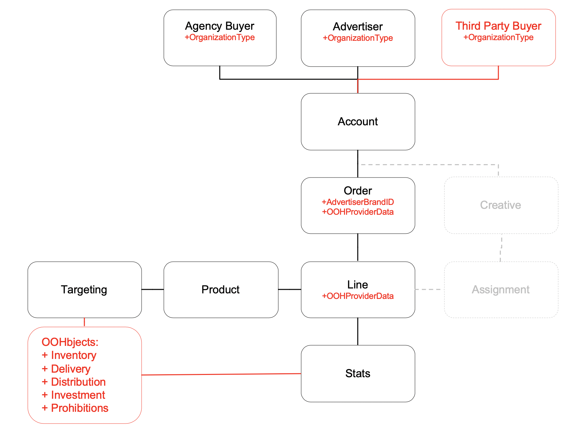

## Version Control

| **Version** | **Author** | **Date** | **Page** | **Description** |
| --- | --- | --- | --- | --- |
| 0.2 | Tim Harvey | 16/03/20 | All | First Draft of OpenDirect (OOH) 1.5.1 |
| 1.0 | Tim Harvey | 24/04/20 | All | PDF Published Version of OpenDirect (OOH) 1.5.1 v1.0 |
| 1.1 | Tim Harvey | from 12/04/20 | See Github Log | Github Published Version of OpenDirect (OOH) 1.5.1 v1.1 |

## Audience

Buy and Sell Side Tech providers can use the specifications in this document to build a system for accessing and booking OOH publisher/media-owner inventory. Tech providers may include the technical staff or partners who work with agencies, networks, exchanges, or specialty vendors that offer inventory purchasing services.

Publishers/Media-Owners also need to use this spec to make their inventory available to API requests from Tech Providers.

# 1. Introduction/Overview

The OpenDirect API provides a standard way for publishers to integrate with tech provider partners so that they can offer premium guaranteed inventory programmatically. Using the API, buyers can build one system that can access inventory from multiple publishers without custom integrations for each one.

Some of the features supported in OpenDirect are:

- Searching product inventory
- Determining price and availability
- Applying targeting and frequency constraints
- Creating orders and adding lines
- Uploading creative and assigning creative to lines
- Reserving and booking inventory

Additional features are added with each new update to further enable wider adoption and support the needs of the industry.

## 1.1 How it works

At a high level, the workflow involves establishing a relationship between buyer and publisher, setting up accounts, and placing orders on the buyer side while publisher systems respond to API requests for order placement. The following table outlines general steps for using the API: Buy

| Buy Side | Sell Side |
| --- | --- |
| **1. Establish a relationship** In order to buy inventory with publishers using OpenDirect systems, buyers must first obtain an ID from the publisher that can be used in any OpenDirect system for as long as you do business with the publisher. | **1. Establish a relationship** To protect your inventory, buyers must first obtain an ID from you. This ID can be used in any OpenDirect compliant system for as long as you maintain a business relationship with the buyer. |
| **2. Set up** Buyers use with their publisher-obtained IDs and create accounts to begin browsing inventory and placing orders. | **2. Set up** Publishers create organization accounts for buyers to access in any OpenDirect system which the publisher has a working relationship. |
| **3. Place Orders** After establishing accounts in the system, buyers can begin browsing publisher inventory and adding lines to orders. | **3. Respond to API Requests** Once buyers are set up in their OpenDirect system(s), they can begin browsing and booking inventory. On the publisher side, this is received as API requests that publisher systems must respond to. |
| **4. Validate Delivery of Orders** Buyers can check the delivery status of In-flight and completed orders | **4. Report on Order Delivery** Request for order delivery progress and completion, based on the targeted metrics of the booked order, is received as API requests that publisher systems must respond to. |

## 1.2 Authorisation

The OpenDirect API is a RESTful API that supports paging query parameters and uses OAuth to authenticate users. A publisher must support at least one &quot;full access&quot; user account (API credentials) per buying organization. Non-buying organizations may have optional user accounts. A publisher may support flexible permission schemes for additional user accounts.

OpenDirect users include:

**Organization:** All organizations that work with the publisher must obtain an Organization ID, whether they are a buyer, or a brand advertiser.

**Buyer:** The buyer is the organization that places orders and usually represents an agency or OOH &#39;Specialist&#39; agency acting on behalf of the advertiser, or the advertiser that places orders directly. If the buyer represents advertisers, the buyer must obtain formal consent for acting on behalf of the advertiser and provide proof of that consent to the publisher.

**Advertisers:** Advertisers represent the brands that purchase publisher inventory for advertising their brands. An advertiser may also be a buyer, but if the advertiser works with a buyer, the advertiser must provide formal consent to allow the buyer to act on its behalf. The Advertiser ID can be used to set up advertiser accounts in an agency or publisher&#39;s OpenDirect system.

## 1.3 Programming Elements

For details about the programming elements that this specification defines, see the following sections.

**Resources:** The key objects, such as Account, Order, Line, Creative, etc. that define the OpenDirect API.

**Common Objects:** Defines the objects that supply field values used in one or more resources, such as Address and Contact.

**Collection Objects:** A list of objects that return an array of values for a field, typically provided by the publisher. For example, publisher-defined target fields (Target) and their values (TargetValue) are provided as collection objects, where Target might be &#39;Age&#39; and the TargetValue would be a list of the publisher-defined age groups (18-24, 25-32, 33-39, etc.)

**URIs and General Request/Response Rules** : Defines the URI supported HTTP verbs (GET, POST, etc.) for each resource.

**Authentication:** Defines the authentication scheme that publishers must use.

**Versioning:** Defines the versioning scheme that publishers must use.

**HTTP Error CodesError Handling:** Defines the error objects that publishers must return for 400 Bad Request errors.

**Reporting:** Defines the reporting URIs and objects.

**OpenDirect Workflow:** Outlines the process for establishing an account and the calls required to create and process an order.

# 2 Resource Objects

The OpenDirect API is a RESTful API that supports JSON. This section uses JSON schemas to define the resource objects used by the API. 
For a diagram that shows the relationships between these resources, see Resource Model.

## 2.1 Account

An account defines a buyer-advertiser relationship. A buyer is typically an agency that places orders on behalf of several advertisers. Each account associates a buyer with one advertiser and is used to manage orders for one publisher. An advertiser may also work with several buyers, and therefore, advertisers have a separate account for each buyer they work with. If an advertiser represents itself, the account identifies the advertiser as both the buyer and the advertiser.

Before an agency may create accounts and perform buys on behalf of the advertiser, the advertiser must give permissions to the agency. The process of giving or removing permissions is publisher-defined. Creating an account must fail if the advertiser has not given the agency permissions.

The Account owns the order.

Account Schema: https://raw.githubusercontent.com/Outsmart-OOH/ooh_open_direct/master/schema/v1/resources/account/account_object.json

## 2.2 Assignment

Creative assignment not in scope for OpenDirect (OOH) 1.5.1

## 2.3 Creative

Creative specification is not in scope for OpenDirect (OOH) 1.5.1

## 2.4 Line

Line resources are included in an order and provide details about the product being booked, status, start and end dates, and other settings for the order item.

Notes: The user may update a line only if it&#39;s in the Draft state. If the line is in the Reserved or Declined state, the user may call Reset to move the line back to the Draft state in order to update the line.

Line Schema: https://raw.githubusercontent.com/Outsmart-OOH/ooh_open_direct/master/schema/v1/resources/line/line_object.json

### 2.4.1 Booking Status Values

- **Draft** – Indicates that a draft of the line has been saved. The line may be updated only in this state. The line remains in this state until the user deletes, reserves, or books the line.
- **PendingReservation** – Indicates that the reservation is in progress. If approved, the state moves to Reserved; otherwise, it moves to Declined. Any user action requested in this state must fail.
- **Reserved** – Indicates that the inventory for the line has been reserved. Remains in this state until the user cancels, books, resets the line or the reservation expires. The ability to reserve inventory is optional. Each publisher determines the length of time that inventory may be reserved without booking before it&#39;s released. If the line is reserved, the ReservedExpiryDate must be set to the date and time that the reserved inventory will expire.
- **PendingBooking** – Indicates that the booking is in progress. If approved, the state moves to Booked; otherwise, it moves to Declined. Any user action requested in this state must fail.
- **Booked** – Indicates that the line is booked and the buyer is obligated to the terms. The line stays in this state until the user cancels the line or the line reaches its delivery window. After the line reaches its delivery window, the line moves to the InFlight state.
- **InFlight** – Indicates that the line is in its delivery window. The line stays in this state until the user cancels the line or the line reaches the end of its delivery window. If the line reaches the end of its delivery window, then it moves to the Finished state; otherwise, it moves to the Stopped state.
- **Finished** – Indicates that the line successfully completed its flight. The line remains in this state.
- **Stopped** – Indicates that the user or publisher cancelled the line while it was in-flight. The StateChangeReason field must specify the reason why the flight was cancelled. The line remains in this state.
- **Cancelled** – Indicates that the user cancelled the line while it was in the Reserved or Booked state. The line remains in this state.
- **Paused** – Indicates that all creative for the line have been temporarily stopped while in Inflight status. Line may return to Inflight status or be updated to the Stopped status if creative is to be cancelled.
- **Expired** – Indicates that the reservation expired. The line remains in this state unless the user resets the line, which moves it back to the Draft state
- **Declined** – Indicates that booking or reservation was declined by the publisher or failed. The line remains in this state unless the user resets the line, which moves it back to the Draft state. The StateChangeReason field must specify the reason why the booking or reservation was declined or failed.
- **PendingChange** – this status is to be used for all asynchronous changes other than reservation and booking.

## 2.5 Order

The Order resource specifies the plan&#39;s start and end dates, estimated budget, currency, and preferred billing method for all line items in the order.

To specify the individual line item details of the order, use the LINE resource specified in section 2.5

Order Schema: https://raw.githubusercontent.com/Outsmart-OOH/ooh_open_direct/master/schema/v1/resources/order/order_object.json

## 2.6 Organisation

The organization resource may represent an advertiser or agency (buyer). The Account determines the role that the organization plays by using the organization ID in place of the BuyerId or AdvertiserId. The organization&#39;s role may vary by account. For example, the organization may be an advertiser in one account and a buyer in another. An advertiser may create one or more organizations to meet their business needs. For example, they may create a single organization and then create accounts for each brand, subsidiary, or division. Or, they may create an organization for each brand. It is up to the advertiser to determine how they use Organization and Account to meet their organizational needs.

Organization Schema: https://raw.githubusercontent.com/Outsmart-OOH/ooh_open_direct/master/schema/v1/resources/organization/organization_object.json

## 2.7 Product

A Product resource identifies anything from an ad placement to a Run of Network product in the publisher&#39;s product catalogue. Values for all supported fields are provided by the publisher.

Product Schema: https://raw.githubusercontent.com/Outsmart-OOH/ooh_open_direct/master/schema/v1/resources/product/product_object.json

## 2.8 Change Request

When an order has already been placed and a change is needed, the ChangeRequest resource can be used to request a change (at Account level) and subsequently modify the order pending the approval of the change request.

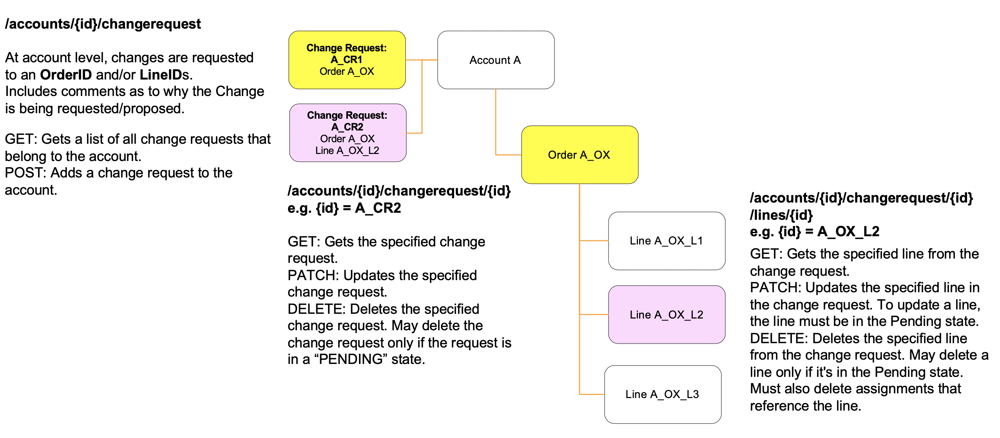

The Order filter request specified in section 7.6.3 can be used to find orders that have a booking status of &quot;PendingChange.&quot;

Change Request Schema: TBC

## 2.9 Stats

A resource to publish the OOH display schedule generated to fulfil the campaign targeting requirements (pre-flight) and the performance of the schedule when the campaign is in flight and/or completed.

Stats Schema: https://raw.githubusercontent.com/Outsmart-OOH/ooh_open_direct/master/schema/v1/resources/stats/stats_object.json

# 3 Common Objects

The following objects are common to one or more resources. For example, the CONTACT common object is used to provide values for both the PRODUCT and ORGANIZATION resources.

## 3.1 Address

Defines address details for an Organization or Contact

Address Schema: https://raw.githubusercontent.com/Outsmart-OOH/ooh_open_direct/master/schema/v1/common/address_object.json

## 3.2 AdvertiserBrand

Defines the details of a Brand associated with an organization

AdvertiserBrand Schema: https://raw.githubusercontent.com/Outsmart-OOH/ooh_open_direct/master/schema/v1/common/advertiserBrand_object.json

## 3.3 Contact

Defines details for an individual contact within an Organization

Contact Schema: https://raw.githubusercontent.com/Outsmart-OOH/ooh_open_direct/master/schema/v1/common/contact_object.json

## 3.4 ProductAvails

Defines the response to a request for product availability and pricing information at product Level

ProductAvails Schema: https://raw.githubusercontent.com/Outsmart-OOH/ooh_open_direct/master/schema/v1/common/productAvails_object.json

## 3.5 ProductAvailsSearch

Defines search criteria used for requesting product availability and pricing within the given search criteria. This object is returned at OOHbject Level based on the OOHbject targeting criteria submitted.

ProductAvailsSearch Schema: https://raw.githubusercontent.com/Outsmart-OOH/ooh_open_direct/master/schema/v1/common/productAvailsSearch_object.json

## 3.6 ProductSearch

The ProductSearch object is used to generate a general list of products independent of their availability. For example, an agency might be interested in looking up all products that are available in Shopping Malls to get an idea for what the options are. Alternatively, the ProductAvailsSearch returns a list of products within specified search criteria with live availability and pricing.

ProductSearch Schema: https://raw.githubusercontent.com/Outsmart-OOH/ooh_open_direct/master/schema/v1/common/productSearch_object.json

## 3.7 OOHProviderData

The OOHProviderData object is used for Buyers to detail information that may be used to identify their order in a Seller&#39;s system using their own IDs or references. This would be mainly used for manually identifying orders in the event of the automated process needing manual intervention.

OOHProviderData Schema: https://raw.githubusercontent.com/Outsmart-OOH/ooh_open_direct/master/schema/v1/common/oohProviderData_object.json

## 3.8 Size

Defines the height and width (in pixels) that a publisher accepts for a given resource (e.g. Product, Creative)

Size Schema:https://raw.githubusercontent.com/Outsmart-OOH/ooh_open_direct/master/schema/v1/common/size_object.json

## 3.9 OOHbject

A collection of targeting criteria used to discover and target the digital and physical presentation aspects of OOH media.

OOHbject Schema: https://raw.githubusercontent.com/Outsmart-OOH/ooh_open_direct/master/schema/v1/common/oohbject_object.json

# 4 Reference Data

This section defines the reference data that an OpenDirect API must support. Reference data provides enumerated values for a resource property. The publisher must return only those values that they support. For example, a resource, such as Order, uses Currency reference data for the currency property to supply the list of currencies that the publisher supports.

## 4.1 AdFormatType

Defines the possible ad formats

| Property   | Description                                                       | Type   | Constraints        |
| ---------- | ----------------------------------------------------------------- | ------ | ------------------ |
| Advertiser | An organisation that is mainly playing the roles of an advertiser | String | Max 254 Characters |
| Specialist | An organisation who's main business is that of an OOH Specialist  | String | Max 254 Characters |
| Agency     | An organisation who's main business is that of a Media Agency     | String | Max 254 Characters |

## 4.2 AdPosition

Not supported in the OpenDirect (OOH) 1.5.1 Schema

## 4.3 Availability

Defines the availability status of a Frame in association with an order, line or other targeted time.

| Property     | Description                                                                                                                | Type   | Constraints       |
| ------------ | -------------------------------------------------------------------------------------------------------------------------- | ------ | ----------------- |
| Available    | The asset is available for the requested in charge period and targeting criteria                                           | String | Max 20 characters |
| Invalid      | The requested asset is not valid (e.g. decommisioned, not recognised)                                                      | String | Max 20 characters |
| Optioned     | The asset has been optioned for the requested in charge period and targeting criteria                                      | String | Max 20 characters |
| Booked       | The asset has been booked for the requested in charge period and targeting criteria                                        | String | Max 20 characters |
| NotAvailable | The asset is not available for the requested in charge period and targeting criteria (potentially for a number of reasons) | String | Max 20 characters |
| NotPermitted | The asset falls outside of the scope of the requested Product (including due to prohibtions, juxtas etc)                   | String | Max 20 characters |

## 4.4 ContactType

Defines the possible types of roles that a Contact plays in an Order

| Property | Description                                                                  | Type   | Constraints       |
| -------- | ---------------------------------------------------------------------------- | ------ | ----------------- |
| Billing  | The person to contact with billing inquiries                                 | String | Max 20 characters |
| Buyer    | The person to contact with general questions about the order                 | String | Max 20 characters |
| Creative | The person to contact if there is an issue with one of the order’s creatives | String | Max 20 characters |

## 4.5 Country

Not supported in the OpenDirect (OOH) 1.5.1 Schema

## 4.6 Currency

Defines the currency that the order is going to be transacted in to ISO 4217 currency codes e.g. GBP, USD, EUR

## 4.7 DeliveryType

Defines the possible types of delivery

| Property       | Description                                                      | Type   | Constraints       |
| -------------- | ---------------------------------------------------------------- | ------ | ----------------- |
| Exclusive      | 100% share of voice.                                             | String | Max 20 characters |
| Guaranteed     | Guaranteed delivery of all booked display and/or impressions     | String | Max 20 characters |
| Non-Guaranteed | Non-Guaranteed delivery of all booked display and/or impressions | String | Max 20 characters |

## 4.8 FrequencyCapInterval

Frequency is supported as a targeting attribute in the OpenDirect (OOH) 1.5.1 targeting OOHbject

## 4.9 Industry

Not supported in the OpenDirect (OOH) 1.5.1 Schema

## 4.10 InventoryType

Inventory Type is supported as a targeting attribute in the OpenDirect (OOH) 1.5.1 targeting OOHbject

## 4.11 Language

Not supported in the OpenDirect (OOH) 1.5.1 Schema

## 4.12 MaturityLevel

Not supported in the OpenDirect (OOH) 1.5.1 Schema

## 4.13 RateType

Rate Type is supported as a targeting attribute in the OpenDirect (OOH) 1.5.1 targeting OOHbject

## 4.14 Targeting

The OpenDirect criteria for targeting.

OpenDirect (and OpenRTB) trades with real time Audience impressions, whereas Out-Of-Home media can be sold in the wider dimensions of time, share of time, location and audience.

OOH Media physically manifests itself as display of the advert on a frame at a defined location and time which then gives an audience in the vicinity of that event an opportunity to see the advertising.

OOHDirect1.5.1 uses the OpenDirect (OOH) OOHbject object (see section 3.11) to discover and target the multidimensional aspect of OOH media.

The use of multiple objects to describe an OOH Product are at the discretion of the media owner/publisher. The simplest OOH product could be described as a single frame with the use of the Inventory OOHbject.

The core identification structure of an OOHbject is

- **Name,Type,DataSource,Target**

The key **Name** descriptions for OOH media targeting are:

- Inventory: What a media owner / publisher sells in terms of Audience or Frames.
- Delivery: How adverts are displayed from a start and end time, and the share of that display time.
- Distribution: How the adverts are distributed across the times and locations booked by audience and/or investment.
- Investment: How the campaign is quantified for trading purposes (Fixes price, Cost Per Thousand Audience, Cost Per Frame).
- Prohibitions: Information about any brand safety prohibitions that will affect the playout of certain brand types in certain locations e.g. fast food prohibitions on certain locations.

The use of the **DataSource** in the OOHbject structure allows the identification and inclusion of third party data sources into the OpenDirect (OOH) schema, which both buyside and sell side may use to describe and discover their available Inventory, location and audiences in accordance with the third party schema. The third party schema may also be published and made discoverable as a collection object as detailed in Section 5 of this document.

Examples of third-party **DataSource** include:

- SPACE (UK OOH Industry frame inventory registry)
- ROUTE (UK OOH Industry audience measurement JIC)
- Geopath (US OOH Industry audience measurement)
- Nielson Total Audience Framework
- Quividi /AdMobilize computer vision analytics segment

### 4.14.1 Inventory OOHbject

The Inventory **Name** OOHbject allows an OOH media owner to describe (and OOH media buyer to buy) their inventory in terms of *Frames* and *Audience* then define the audience metrics that are available to targeted.

#### Summary

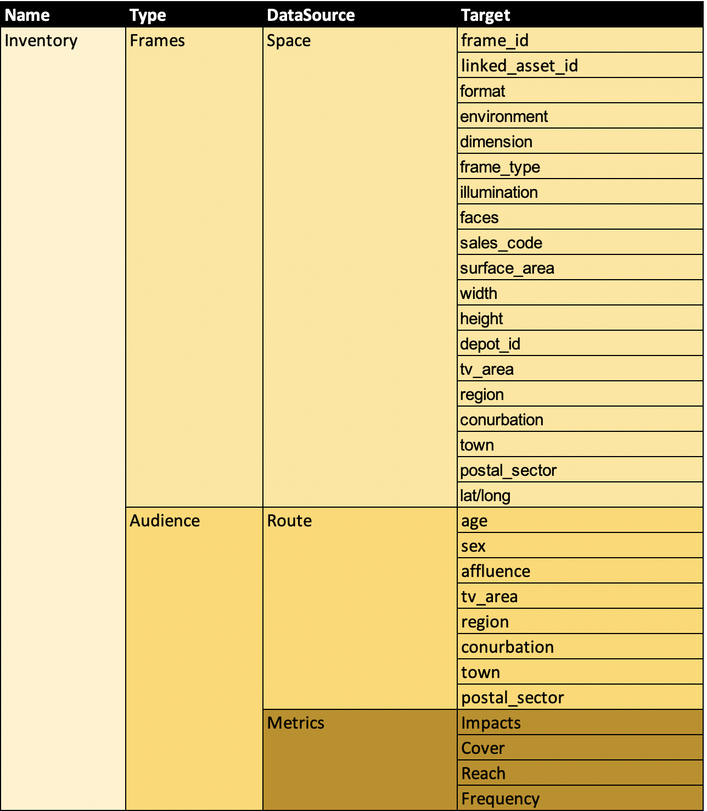

#### Inventory,Frames,SPACE,x

As the initial implementation of OpenDirect (OOH) 1.5.1 is in the UK, this object uses the UK Outsmart industry bodies&#39; SPACE register for the identification of Frame inventory.

SPACE has created a single source data point to coordinate and categorise the unique identification characteristics of all UK OOH inventory. This register identifies a frame with a common id and also allows media owners to attach frame details to the record in terms of dimension, media type, format and location.

Further information can be found at [https://www.outsmart.org.uk/news/welcome-space](https://www.outsmart.org.uk/news/welcome-space)

These classifications could be taken and used as a common format in countries/markets where no common standards currently exist.

Alternatively, the Inventory.Frames OOHbject can reference a Media Owner / Publisher's own description of inventory e.g. 
Inventory.Frames.<MediaOwnerName>.TramWraps

#### Inventory,Audience,ROUTE,x

As the initial implementation of OpenDirect (OOH) 1.5.1 is in the UK, this object uses the Route dataset to describe and segment OOH audiences.

Route produces audience estimates for out-of-home advertising in Britain. The data Route publishes tell subscribers how many and what type of people see an advertising campaign, and how often they do so. The information is used as the currency for planning, trading and valuing advertising investment in the medium at frame level.

The trade associations for the buyers and sellers of the medium underwrite Route jointly. The IPAO represents the interests of the specialist OOH agencies (or planners &amp; buyers) working on behalf of advertisers. Outsmart represents the interests of the media owners (or sellers).

The underwriting agencies are [Kinetic Worldwide](http://www.kineticww.com/), [Mediacom Outdoor](http://www.mediacom.com/en/home), [Posterscope](http://www.posterscope.com/), [Rapport Worldwide](http://www.rapportww.com/uk/) and [Talon Outdoor](http://talonoutdoor.com/). The media owner guarantors are [Clear Channel Outdoor](http://www.clearchannel.co.uk/),  [JCDecaux](http://www.jcdecaux.co.uk/)  and [Global](http://global.com/outdoor/).

Route has over 400 categories of audience classification and reports the audience metrics at both pedestrian and vehicular level as impacts, ratings, reach and cover.

Further information on route can be found at [www.route.org.uk](http://www.route.org.uk/)

#### Inventory,Audience,Metrics,x

Allows the Media Owner / Publisher to define the audience metrics that are available to targeted and allows the buyer to specify these metrics when performing an availability check or setting up an order line.

### 4.14.2 Delivery OOHbject

The Delivery OOHbject allows an OOH media owner to describe (and OOH media buyer to buy) how their campaign is delivered to selected inventory.

#### Summary

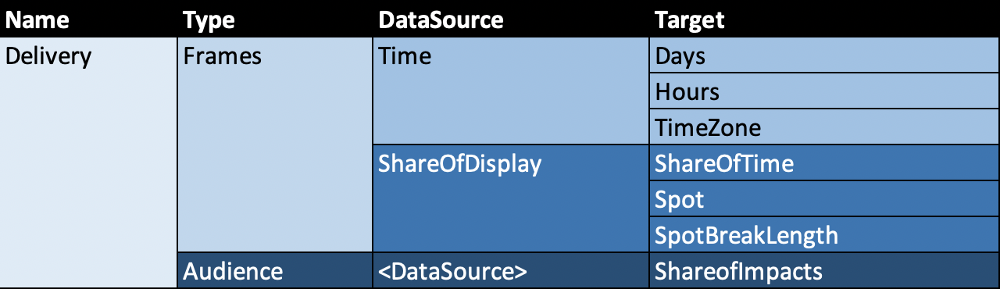

#### Delivery,Frames,Time,Days

If this is made available, this dynamic OOHbject details an array of numbered days that can be targeted within in the product. This dynamic array takes the form of the days available from the booking line start and end date

e.g.

Booking line date 08/11/20 to 17/11/20

Delivery.Frames.Time.Days = [1,2,3,4,5,6,7] based on ISO 8601

The OOHbject field *Selectable* indicates if this array is further targetable e.g. the Days array of [1,2,3,4,5,6,7] is returned, and if the Days are flagged as *Selectable*, the buyer may select days [6,7].

#### Delivery,Frames,Time,Hours

If this is made available, this dynamic OOHbject details an array of numbered hours that can be targeted within in the product. This dynamic array takes the form of the hours available from the specified booking line start and end date

e.g.

Booking line date 08/11/20 00:00 to 17/11/20 00:00

Delivery.Frames.Time.Hours = [1,2,3,4,……,24,25,26,…..48,……,72,…..,96,……120….144,145,….,168]

The OOHbject field *Selectable* indicates if this array is further targetable e.g. the Hours array is returned, and if the Hours are flagged as *Selectable*, the buyer may select Hours [6,7,8,9,30,31,32,33].

The example below shows how the hours of 10am to 2pm on Day 1 and Day 2 would be targeted as an array selection.

Hours[10,11,12,13,34,35,36,37]

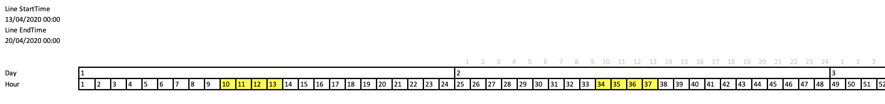

Practically, the booking UI should convert the days/hours selected from a calendar based UI into the hour array in the background.

#### Delivery,Frames,Time,TimeZone

This OOHbject can be used in the targeting array to indicate if the days and/or hour delivery of the campaign happens in the local time zone (e.g. the local time of where the advert is displayed) or Coordinated Universal Time (e.g. UTC playout would ensure the advert plays at the same exact moment around the world).
The TargetValues are "Local" or "UTC". The default is "Local" time

#### Delivery,Frames,ShareOfDisplay,ShareOfTime

This OOHbject details the *ShareOfTime* that can be targeted within the product. The *ShareOfTime* can be described as the percentage of time the advert appears on screen vs the time the advert does not appear on screen over the flight of the campaign.

e.g.

A fixed 1 in 4 loop/scrolling billboard with have a *ShareOfTime* value of 25

A classic paper/vinyl billboard will have a *ShareOfTime* value of 100

#### Delivery,Frames,ShareOfDisplay,Spot

This OOHbject details the *Spot* length (or array of lengths) in seconds that a digital advert can run for each time it appears on a frame. The *Spot* length will affect the frequency of play out within the campaign flight.

e.g. if the Campaign flight is 10 hours, the *ShareOfTime* value is 20(%) and the creative is 1 hour long, the *Spot* will play 2 times.

if the Campaign flight is 10 hours, the *ShareOfTime* value is 20(%) and the creative is 10s long, the *Spot* will play 720 times.

If the Campaign flight is 10 hours, the *ShareOfTime* value is 100(%) and the creative is 10s long, the *Spot* will play 3600 times.

#### Delivery,Frames,ShareOfDisplay,SpotBreakLength (Optional)

If the product delivers the campaign within a fixed loop, the *SpotBreakLength* OOHbject details the length of time in seconds between the Spots being played.

e.g. in a 30 second loop where the Spot length is 5 Seconds:

Spot = 5

SpotBreakLength = 25

#### Delivery,Audience,DataSource,ShareOfImpacts

An average % share of viewed impacts across the targeted OOHbjects according to the Audience DataSource identified.

e.g. the campaign needs to be delivered to 30% of the available 'Affluent Female Shopper Audience' over the flight of the campaign

### 4.14.3 Investment OOHbject

The Investment OOHbject allows an OOH media owner to describe (and OOH media buyer to buy) their inventory in terms of *Frames* and *Audience* Investment.

#### Summary

*Local_Currency* is defined as the currency that the order is going to be transacted in to ISO 4217 currency codes e.g. GBP, USD, EUR

#### Investment,Total,Local_Currency,Fixed

If this is made available, this dynamic OOHbject details (in terms of the local currency) the requested total Product price or given total Product price based on the other OOHbject targeting values given.

#### Investment,Frames,Local_Currency,CPF

If this is made available, this dynamic OOHbject details (in terms of the local currency) the requested *cost per frame* price or a target *cost per frame* price based on the other OOHbject Product targeting values given.

#### Investment,Audience,Local_Currency,CPT

If this is made available, this dynamic OOHbject details (in terms of the local currency) the requested *cost per thousand* price or a target *cost per thousand* price based on the other OOHbject Product targeting values given.

### 4.14.4 Distribution OOHbject

The Distribution OOHbject allows an OOH media owner to describe (and OOH media buyer to understand and specify) if their campaign Delivery is Distributed evenly or flexibly across the Campaign flight in terms of Time, audience and/or investment.

Specific targets for Audience, Location and Display Time would be made using arrays of Inventory and Delivery OOHbjects, rather than the Distribution OOHbject itself.

#### Summary

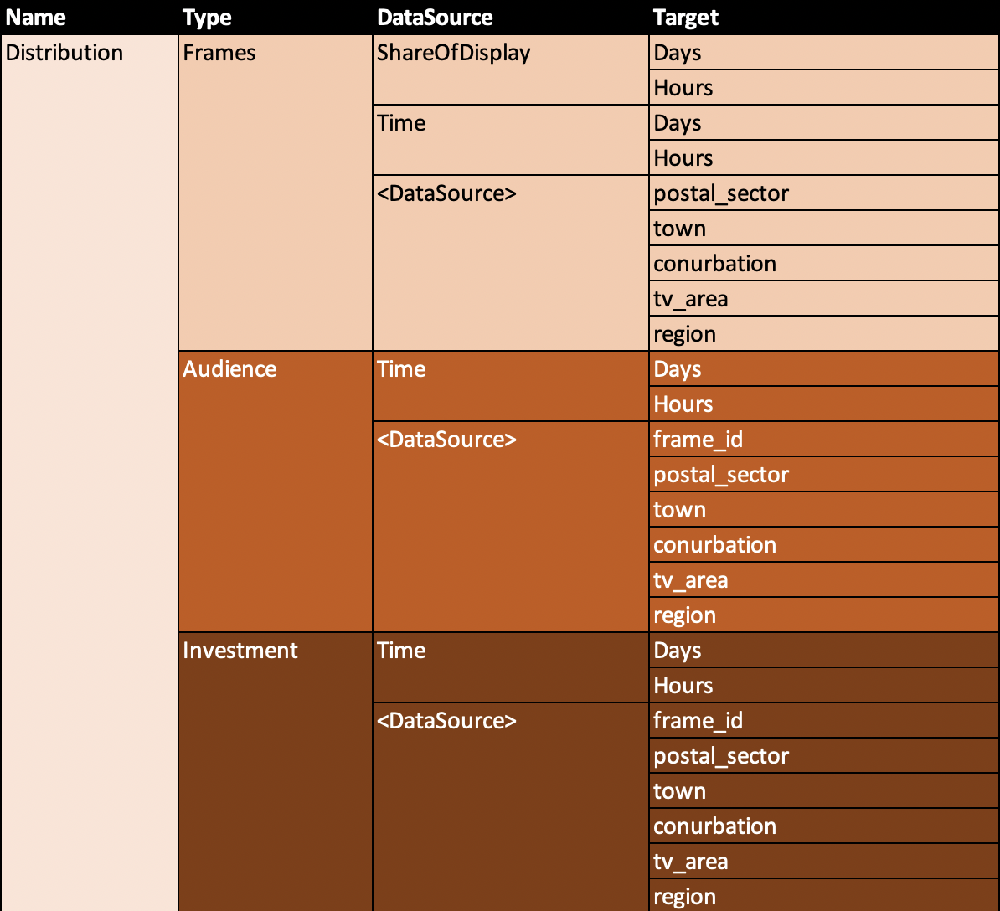

The segment array for every Distribution.z.x.y object gives a choice of an even *Fixed* distribution or a *Flexible* distribution that achieves the Campaign Inventory and Delivery targets over the campaign flight.

#### Distribution,Frames,x,y

This OOHbject describes how the delivery of the campaign display is distributed over the campaign to frames, times or (DataSource) locations.

The default setting for this Distribution OOHbject is *Flexible* meaning that the targeted *ShareOfDisplay* and/or frame volumes will be achieved in total over the campaign flight.

e.g.
- ShareOfDisplay,Days = Fixed, the ShareOfTime and/or total Spot Frequency will be delivered over each selected Day over the campaign flight
- ShareOfDisplay,Hours = Fixed, the averaged ShareOfTime and/or total Spot Frequency will be delivered on each selected Hour over the campaign flight
- Time,Days = Fixed, the same volume of Frames will be delivered on each selected Day over the campaign flight
- Time,Hours = Fixed, the same volume of Frames will be delivered on each selected Hour over the campaign flight
- (DataSource),frame_id = Fixed, a fixed volume of frames will deliver the campaign targeting objectives.
- (DataSource),region = Fixed, a fixed volume of frames per region will deliver the campaign targeting objectives (there will be fliexibility within the region which frames are actually used to deliver the campaign targets)

#### Distribution,Audience,x,y

This OOHbject describes how the delivery of the targeted campaign audience is distributed over the campaign flight to audience, time or (DataSource) locations.

The default setting for this Distribution OOHbject is *Flexible*; meaning that the total targeted audience impact volume will be delivered over the campaign flight time, but different days, hours and/or locations may have different audience delivery volumes.

e.g.
- Time,Day = Fixed, the same volume of audience impacts will be delivered on each day to achieve the total audience target
- Time,Hour = Fixed, the same volume of audience impacts will be delivered on hour
- (DataSource),frame_id = Fixed, the same volume of audience impacts will be delivered at each Frame location over the campaign flight.
- (DataSource),postal_sector = Fixed, the same volume of audience impacts will be delivered within each Postal Sector over the campaign flight.
- (DataSource),town = Fixed, the same volume of audience impacts will be delivered within each Town over the campaign flight.
- (DataSource),conurbation = Fixed, the same volume of audience impacts will be delivered within each Conurbation over the campaign flight.
- (DataSource),tv_area = Fixed, the same volume of audience impacts will be delivered within each TV Area over the campaign flight.
- (DataSource),region = Fixed, the same volume of audience impacts will be delivered within each TV Area over the campaign flight.

The addition of Inventory,Audience,Metrics,x OOHbject to the targeting array determines the Audience metrics being used e.g.

- Inventory,Audeince,Metrics,Cover (percentage of the population that saw the advert)
- Inventory,Audeince,Metrics,Reach (Unique Audience Count)
- Inventory,Audeince,Metrics,Frequency (eNumber of times the Audience reached sees the Advert)

It is up to the Media Owner if they can support such campaign metrics & scheduling distribution in each product they make available to the Media Buyer.

#### Distribution,Investment,x,y

This OOHbject describes how the delivery of the targeted campaign investment is distributed over time and locations in the campaign flight.

The default setting for this Distribution OOHbject is *Flexible* meaning that the targeted campaign investment will be delivered over the campaign flight time. Individual days, hours or locations may have different investment pacing.

e.g.
- Time,Day = Fixed, the same investment will be delivered on each day to achieve the total investment target
- Time,Hour = Fixed, the same investment will be delivered in each hour to achieve the same investment target
- (DataSource),frame_id= Fixed, the same investment will be delivered at each Frame location over the campaign flight to achieve the campaign investment target.
- (DataSource),postal_sector = Fixed, the same investment will be delivered within each Postal Sector over the campaign flight to achieve the campaign investment target.
- (DataSource),town = Fixed, the same investment will be delivered within each Town over the campaign flight to achieve the campaign investment target.
- (DataSource),conurbation = Fixed, the same investment will be delivered within each Conurbation over the campaign flight to achieve the campaign investment target.
- (DataSource),tv_area = Fixed, the same investment will be delivered within each TV Area over the campaign flight to achieve the campaign investment target.
- (DataSource),region = Fixed, the same investment impacts will be delivered within each TV Area over the campaign flight to achieve the campaign investment target.

### 4.14.5 Prohibitions OOHbject

The Prohibitions OOHbject allows an OOH media owner to describe (and OOH media buyer to understand) their inventory in terms of frame prohibitions from a named DataSource that will affect if their brand or advert can be displayed at a certain product locations.

#### Summary

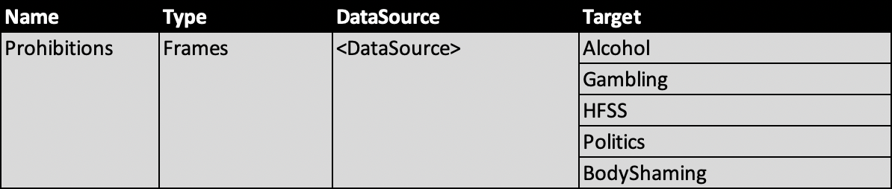

This object is attached to the Product Targeting Object to expose all FrameIDs (via the Segment) which may be affected by any of the prohibitions listed.

e.g. if the product contains the frame ids of

1234931339, 1235190735, 1234931338, 1235191547,1234931569 and 1235202465

and the frames

1234931339, 1235190735

are prohibited from displaying alcohol brands,

this could be shown as:

Prohibitions.Frames.SPACE.Alcohol = [1234931339, 1235190735]

This is for descriptive purpose only and the master frame to prohibitions table may be managed elsewhere by the publisher/media owner.

# 5 Collection Objects

For GET calls that return a collection of resources, such as /accounts/{id}/orders, the response must be an object that contains an array of the requested resources. The array must be named according to the type of resource it contains. The following table identifies the property name that must be used for each collection call.

| **Call** | **Property Name** | **Resource** |
| --- | --- | --- |
| /organizations/organizations?$filter | organizations | [Organization](#_bookmark3) |
| /advertiserbrands/advertiserbrands?$filter | advertiserbrands | AdvertiserBrand |
| /accounts/accounts?$filter | accounts | Account |
| /accounts/{id}/assignments/accounts/{id}/assignments?$filter | assignments | Assignment |
| /accounts/{id}/orders/accounts/{id}/orders?$filter | orders | Order\_Campaign\_Assignment |
| /accounts/{id}/orders/{id}/lines/accounts/{id}/orders/lines?$filter | lines | Lines\_Assignment |
| /products/products/search (POST) | products | Product\_Assignment |
| /products/avails (POST) | avails | ProductAvails\_Assignment |
| /oohbjects/dataSources/oohbjects/dataSources?filter | dataSources | Data Sources |

The following shows an example response for /accounts.

{

 Accounts: [
 
{

"AdvertiserId": "B7EBC7F3-FBB3-4250-99F1-8D001088434B",

"BuyerId": "4AA837B7-1A27-421E-9DDD-CAEF1AE884B5", 

"Id": "9B0878BE-7254-49BE-AFD4-B0A67C7C3D26"

},

{

"AdvertiserId": "16B55667-37CF-4447-A79D-88E6DAC4D7C2", 

"BuyerId": "4AA837B7-1A27-421E-9DDD-CAEF1AE884B5",

"Id": "EAC93F5D-F448-44D6-8333-4E530D14C9DA"

}

]

}

The collection object may include additional publisher-defined properties. If there are no resources to return, the array must be empty.

# 6 OpenDirect General Support Requirements

## 6.1 Authentication

Publishers must support authenticating advertiser and agency users. Publishers must use [OAuth 2.0](http://tools.ietf.org/html/draft-ietf-oauth-v2-15) for user authentication. Publishers must support the implicit and authorization code grant flows.

Each request must include an AccessToken header that is set to the user&#39;s access token. If the token is not valid, the request must fail with HTTP status code 401 Unauthorized.

## 6.2 Versioning

Versioning occurs at the API level and is URI based. All services that make up the API must use the same version number. The version may fall anywhere in the path before the resource and must have the form vn[.n][.n], where n is a positive integer. For example, in the URI https://\\&lt;host\\&gt;/api/v1.2.3/accounts/{id}, v1.2.3 indicates version 1.2.3 of the API.

## 6.3 HTTP Error Codes/ErrorHandling

The publisher must support the following HTTP status codes.

| **Status Code** | **Description** |
| --- | --- |
| **200 Ok** | Return for a successful GET, POST,or PATCH request. |
| **400 Bad Request** | Return for a POST, PATCH request that contains invalid data, or when the requested action (i.e. book) is not valid.The response must include the reasons for the error. For details, see Error Response. |
| **401 Unauthorized** | Return if the user is not authorized to make the request. |
| **404 Not found** | Return if the requested resource is not found. |
| **500 Internal server error** | Return for server-related errors. |

The API may support the following HTTP status codes.

| **Status Code** | **Description** |
| --- | --- |
| **302 Found** | Return if the resource has moved. The Location header must include the new URI. |
| **304 Not modified** | Return for requests that include the If-None-Match header (to support ETags) and the resource has not changed. |
| **412 Precondition failed** | Return for requests that include the If-Match header (to support ETags) and the resource has changed. |

## 6.4 ErrorResponse

If the request generates a 400 Bad Request status code, the response must contain a collection object; the collection object must contain a single field named **errors**. The value of **errors** is an array of one or more error objects. The following table defines the properties of the error object.

| **Property** | **Type** | **Required/Optional** | **Description** |
| --- | --- | --- | --- |
| **ErrorCode** | String | Required | A symbolic string constant that identifies the error. |
| **Context** | Dictionary\&lt;string, object\&gt; | Optional | A list of Publisher-defined key/value pairs that provide additional context about the error. For example, an ID that identifies a log entry. |
| **Link** | String | Optional | A URL to additional help text that may help the callersolve theissue. |
| **ErrorMessage** | String | Required | A string that describes the error that occurred. |

The following shows the body of an example error response.

{

&quot;Errors&quot;: [

{

&quot;Context&quot;: {
            "Name": "Inventory",
            "Type": "Frames",
            "DataSource": "Space",
            "Target": "frame_id",
            "TargetValues": [
                1234931339,
                1235190735,
                1234931338,
                1235191547
            ]
        }

&quot;Message&quot;: &quot;Frames are not selectable in this product&quot;, &quot;errorCode&quot;: &quot;FramesNotSelectable&quot;,

&quot;Link&quot;: &quot;https:\\host\help\SelectFrames.aspx&quot;

},

{

&quot;Context&quot;:{},

&quot;Message&quot;:&quot;&quot;,

&quot;ErrorCode&quot;: &quot;&quot;,

&quot;Link&quot;: &quot;&quot;

},

]

}

## 6.5 Data Format

Supported mime type: application/json

## 6.6 Logical JSON operators

Logical AND, OR operators are supported within JSON requests as $and, $or operators. Further logical operators may be added if the Media Owner / Publisher has the capability to action such requests.

| **Operator** | **Description** | **Example** |
| --- | --- | --- |
| $and | Performs an AND operation on an array with at least two expressions and returns the document that meets all the expressions. | {&quot;$and&quot;:[{&quot;age&quot;:5},{&quot;name&quot;:&quot;Joe&quot;}]} |
| : | Performs as alternative syntax to the $and operator. | {&quot;name&quot;:&quot;Joe&quot;,&quot;age&quot;:5} |
| $or | Performs an OR operation on an array with at least two expressions and returns the documents that meet at least one of the expressions. | {&quot;$or&quot;:[{&quot;age&quot;:4},{&quot;name&quot;:&quot;Joe&quot;}]} |

Reference:

[https://www.ibm.com/support/knowledgecenter/SSEPGG\_11.1.0/com.ibm.swg.im.dbclient.json.doc/doc/r0061295.html](https://www.ibm.com/support/knowledgecenter/SSEPGG_11.1.0/com.ibm.swg.im.dbclient.json.doc/doc/r0061295.html)

[https://restdb.io/docs/querying-with-the-api](https://restdb.io/docs/querying-with-the-api)

## 6.7 Stats (OOH Schedule &amp; Delivery Reporting)

A method to publish the OOH display schedule generated to fulfil the campaign targeting requirements (pre-flight) and the performance of the schedule when the campaign is in flight and/or completed.

| **URI** | **Description** |
| --- | --- |
| **/accounts/{id}/orders/{id}/lines/stats** | Aggregates the spot, impacts, time and spend for all lines in the order. |
| **/accounts/{id}/orders/{id}/lines/{id}/stats** | Aggregates the spot, impacts, time and spend for the specified line. |

The &#39;Stats&#39; resource enables the publishing of the schedule and the delivery of the schedule to the following fields and granularity:

### 6.7.1 Report Fields

| Field          | Definition                                                                                                                                            |
| -------------- | ----------------------------------------------------------------------------------------------------------------------------------------------------- |
| StartDate      | The Start Date and Time in UTC  for the Stat                                                                                                          |
| EndDate        | The End Date and Time in UTC for the Stat                                                                                                             |
| SpotLength     | The amount of time the advertiser has to play their creative in - If an advertisement is on screen for this length of time, this constitutes one play |
| ShareOfTime    | An Average % share of total time across the dimensions reported on for the campaign (e.g. play, hour. panel, geography)                               |
| FrameID        | The ID of the Frame that the delivery is carried out upon                                                                                             |
| CreativeID     | The ID of the creative file that is played out in the Spot                                                                                            |
| BookedPlays    | The number of times a creative (with a defined spot length) has started playing but it may not have been fully played                                 |
| DeliveredPlays | The number of times a creative (with a defined spot length is fully played)                                                                           |
| Delivery       | % of Delivered Plays vs Booked Plays                                                                                                                  |

### 6.7.2 Granularity

The Schedule and Delivery data can be requested and or served at Flight, Week, Day, Hour and/or Spot level of granularity

## 6.8 Paging QueryParameters

For any resource that returns lists of data, these resources should support paging. Two resource parameters—count and offset—will be required in order to support paging. If the parameters aren&#39;t included, the total number of available data might not be returned.

count: Indicates the number of desired records to be returned in the response.

offset: Indicates the starting point from which the number of records should be returned in the response. If you wish to start with the first record, you must provide 0. Always use the number prior to the record position that is desired. For example, you have 100 records and wish to return 25 per page, you would specify it this way:

count= 25, offset 0

count= 25, offset25

count= 25, offset50

count= 25, offset 75 Recommended Count Limit: 250

### 6.8.1 Custom Headers

When using paging, the consumer may need to know how many total records there are so this should be part of the response. There are two options here. One would be to return the total count in an outer json object to the request. The other is to use a custom header. The custom header is preferable because it does not become part of the model represented by the json. The con is, many frown upon custom headers.

Header Name: X-Total-Count

# 7 URIs and General Request/Response Rules

URIs are what the API uses to communicate OpenDirect resource object details between publisher and provider systems. The following list of rules apply to all resources in general, but rules specific to each resource, along with examples for requests and responses, are described in more detail in the following sections. A summary of resource URIs is provided in section 7.1.

1. If the following is true for the request, the response must not include the property.

- The Value is NULL
- There is no default value
- Its type is numeric or a string

However, if the property is an array of any type and is NULL, the response must include the property and it must be set to an empty array.

2. All POST (add operations) and PATCH requests must include the resource in the response.

3. For POSTs (add operations), ignore properties that are set to NULL. However, for PATCH, if a property is set to NULL, remove the current value.

## 7.1 URI Summary Table

| Resource             | URI                                           | Verbs              | Required |
| -------------------- | --------------------------------------------- | ------------------ | -------- |
| Account              | /accounts                                     | GET, POST          | Yes      |
|                      | /accounts/{id}                                | GET                | Yes      |
|                      | /accounts?$filter=                            | GET                | Yes      |
| Assignment           | /accounts/{id}/assignments                    | GET, POST          | Yes      |
|                      | /accounts/{id}/assignments/{id}               | GET, PATCH, DELETE | Yes      |
|                      | /accounts/{id}/assignments/{id}?disable       | PATCH              | Yes      |
|                      | /accounts/{id}/assignments?$filter=           | GET                | No       |
|                      | /accounts/{id}/creatives?$filter=             | GET                | No       |
| Order                | /accounts/{id}/orders                         | GET, POST          | Yes      |
|                      |                                               | GET, PATCH, DELETE | Yes      |
|                      | /accounts/{id}/orders/{id}                    | GET                | No       |
|                      | /accounts/{id}/orders?$filter=                | GET                | YES      |
| Line                 | /accounts/{id}/orders/{id}/lines              | GET, POST          | Yes      |
|                      | /accounts/{id}/orders/{id}/lines/{id}         | GET, PATCH, DELETE | Yes      |
|                      | /accounts/{id}/orders/{id}/lines/{id}?book    | PATCH              | Yes      |
|                      | /accounts/{id}/orders/{id}/lines/{id}?reserve | PATCH              | Yes      |
|                      | /accounts/{id}/orders/{id}/lines/{id}?cancel  | PATCH              | Yes      |
|                      | /accounts/{id}/orders/{id}/lines/{id}?reset   | PATCH              | Yes      |
| Organizations        | /organizations                                | GET                | Yes      |
|                      | /organizations/{id}                           | GET                | Yes      |
|                      | /organizations?$filter=                       | GET                | No       |
| Products             | /products                                     | GET                | Yes      |
|                      | /products/{id}                                | GET                | Yes      |
|                      | /products/search                              | POST               | Yes      |
|                      | /products/avails                              | POST               | Yes      |
| Change Request       | /accounts/{id}/changerequest                  | GET, POST          | No       |
|                      | /accounts/{id}/changerequest/{id}             | GET, PATCH, DELETE | No       |
|                      | /accounts/{id}/changerequest?$filter=         | GET                | No       |
|                      | /accounts/{id}/changerequest/{id}/approve     | PUT                | No       |
|                      | /accounts/{id}/changerequest/{id}/reject      | PUT                | No       |
| Change Request Lines | /accounts/{id}/changerequest/{id}/lines       | GET, POST          | No       |
|                      | /accounts/{id}/changerequest//lines/{id}      | GET, PATCH         | No       |
|                      | /accounts/{id}/changerequest//lines?$filter=  | GET                | No       |
| Reporting            | /accounts/{id}/orders/{id}/lines/stats        | GET                | No       |
|                      | /accounts/{id}/orders/{id}/lines/{id}/stats   | GET                | No       |
| Advertiser Brands    | /advertiserbrands                             | GET                | No       |
|                      | /advertiserbrands/{id}                        | GET                | No       |
|                      | /advertiserbrands?$filter=                    | GET                | No       |
| DataSources          | /datasources                                  | GET                | No       |
|                      | /datasources/datasource                       | GET                | No       |
|                      | /datasources?$filter=                         | GET                | No       |

## 7.2 Account

The account resource associates an organization ID for a buyer with an organization ID for an advertiser. Account URIs enable account creation and account search.

### 7.2.1 /accounts

Adds an Account or gets a list of accounts that the user has access to. The response must support pagination. See Paging Query Parameters.

#### Verbs

GET: Gets a list of all accounts.

POST: Adds an account.

#### Rules

An advertiser or agency may add accounts to only the organization they own; an agency may not add accounts to an advertiser&#39;s organization.

If an advertiser wants an agency to manage an account on their behalf, the advertiser must add the account and set the account&#39;s BuyerId to the agency&#39;s organization ID.

If an agency wishes to use a third-party buyer to manage an account on their behalf, the agency must add the account and set the account&#39;s ThirdPartyId to the agency&#39;s BuyerID.

An organization may add as many accounts as needed to create a buying structure that supports their needs. For example, the organization may create a single account, an account for each region, an account for each brand, and so on.

For an advertiser, the list of accounts will include only accounts that they own. However, for an agency and a third party, the list of accounts will include the accounts that they own and the accounts that they manage on behalf of advertisers.

### 7.2.2 /accounts/{id}

Gets the specified Account.

#### Verb

GET: Gets the specified account.

#### Rules

The user must have permissions to perform the requested action. For example, advertisers and agencies may get the accounts that they own. In addition, an agency may get the accounts that they manage on behalf of advertisers.

### 7.2.3 /accounts?$filter=

The response must support pagination. See Paging Query Parameters.

#### Verb

GET: Gets a list of accounts that match the specified filter criteria. The user may use OData expressions with the following Account properties:

- AdvertiserId
- BuyerId
- ThirdPartyId

May also support getting a list of IDs.

#### Rules

Only an advertiser or a buyer or third-party who own the accounts can issue the request. User should be able to filter the accounts by any of the fields or field values of the owned account. Logical AND/OR condition of the fields shall be allowed.

### 7.2.4 Account Examples

| URI                                      | Verb | Description                                                      | Request                                                                                                                                                | Response                                                                                                                                                      |
| ---------------------------------------- | ---- | ---------------------------------------------------------------- | ------------------------------------------------------------------------------------------------------------------------------------------------------ | ------------------------------------------------------------------------------------------------------------------------------------------------------------- |
| /accounts                                | GET  | Get a list of all accounts                                       |                                                                                                                                                        | [GET\_accounts\_response.json](https://github.com/Outsmart-OOH/ooh_open_direct/blob/master/examples/OOHpenDirect_1-5-1_v-1/GET_accounts_response.json)        |
| /accounts                                | POST | Media Owner creates a new account                                | [POST\_accounts\_request.json](https://github.com/Outsmart-OOH/ooh_open_direct/blob/master/examples/OOHpenDirect_1-5-1_v-1/POST_accounts_request.json) | [POST\_accounts\_response.json](https://github.com/Outsmart-OOH/ooh_open_direct/blob/master/examples/OOHpenDirect_1-5-1_v-1/POST_accounts_response.json)      |
| /accounts/{id}                           | GET  | Get account details by ID                                        |                                                                                                                                                        | [GET\_accounts\_id\_response.json](https://github.com/Outsmart-OOH/ooh_open_direct/blob/master/examples/OOHpenDirect_1-5-1_v-1/GET_accounts_id_response.json) |
| /accounts?$filter= (e.g. ?buyerId=34587) | GET  | Gets a list of accounts that match the specified filter criteria |                                                                                                                                                        | [GET\_accounts\_response.json](https://github.com/Outsmart-OOH/ooh_open_direct/blob/master/examples/OOHpenDirect_1-5-1_v-1/GET_accounts_response.json)        |

## 7.3 Account Assignments

Account assignments associate a creative with a line. This is not currently in scope for OpenDirect (OOH) 1.5.1, with creative submission &amp; assignment handled in the publisher/media-owner&#39;s own CMS systems.

## 7.4 Account Creative

Account creative holds all creative for the advertiser identified for an account. These creative can be assigned to one or more lines for one or more orders under the account using the assignment object. This is not currently in scope for OpenDirect (OOH) 1.5.1, with creative submission &amp; assignment handled in the publisher/media-owner&#39;s own CMS systems.

## 7.5 Account Orders

Adds an Order or gets a list of orders that the user has access to. The response must support pagination. See Paging Query Parameters.

### 7.5.1 /accounts/{id}/orders

#### Verbs

GET: (required) Gets a list of all orders that belong to the account.

POST: (required) Adds an order to the account.

#### Rules

An advertiser or agency may add orders to accounts that they own. In addition; an agency may add orders to accounts that they manage on behalf of advertisers.

For advertisers, the list will include only orders that they own. For agencies and third parties, the list will include the orders that they own and the orders that belong to accounts that they manage on behalf of advertisers.

### 7.5.2 /accounts/{id}/orders/{id}

Gets, updates or deletes the specified Order.

#### Verbs

GET: (required) Gets the specified order.

PATCH: (required) Updates the specified order.

DELETE: (required) Deletes the specified order. May delete the order only if all lines in the order are in the Draft state. Must also delete assignments that reference the line.

#### Rules

The user must have permissions to perform the requested action. For example, advertisers and agencies may get, update, and delete the orders that they own. In addition, an agency may get, update, and delete the orders that belong to the accounts that they manage on behalf of advertisers.

Only orders in the Draft booking state may be deleted.

### 7.5.3 /accounts/{id}/orders?$filter=

The response must support pagination. See Paging Query Parameters.

#### Verbs

GET: (optional) Gets a list of creatives that match the specified filter criteria.

- AdStatus

May support getting a list by IDs.

#### Rules

User should be either an advertiser or buyer who owns the orders.

### 7.5.4 Order Examples

| URI                            | Verb | Description                                                       | Request                                                                                                                                            | Response                                                                                                                                                  |
| ------------------------------ | ---- | ----------------------------------------------------------------- | -------------------------------------------------------------------------------------------------------------------------------------------------- | --------------------------------------------------------------------------------------------------------------------------------------------------------- |
| /accounts/{id}/orders          | GET  | Reqestor gets a list array of all orders against an account id    |                                                                                                                                                    | [GET\_orders\_response.json](https://github.com/Outsmart-OOH/ooh_open_direct/blob/master/examples/OOHpenDirect_1-5-1_v-1/GET_orders_response.json)        |
| /accounts/{id}/orders          | POST | Media Buyer creates a new order                                   | [POST\_orders\_request.json](https://github.com/Outsmart-OOH/ooh_open_direct/blob/master/examples/OOHpenDirect_1-5-1_v-1/POST_orders_request.json) | [POST\_orders\_response.json](https://github.com/Outsmart-OOH/ooh_open_direct/blob/master/examples/OOHpenDirect_1-5-1_v-1/POST_orders_response.json)      |
| /accounts/{id}/orders/{id}     | GET  | Gets, updates or deletes the specified Order                      |                                                                                                                                                    | [GET\_orders\_id\_response.json](https://github.com/Outsmart-OOH/ooh_open_direct/blob/master/examples/OOHpenDirect_1-5-1_v-1/GET_orders_id_response.json) |
| /accounts/{id}/orders?$filter= (e.g. ?AdvertiserBrandId=73)| GET  | Gets a list of creatives that match the specified filter criteria |                                                                                                                                                    | [GET\_orders\_response.json](https://github.com/Outsmart-OOH/ooh_open_direct/blob/master/examples/OOHpenDirect_1-5-1_v-1/GET_orders_response.json)        |

## 7.6 Account Order Lines

Lines hold the product details that are added to an order for an account. Creative assignment not currently in scope for OpenDirect (OOH) 1.5.1.

### 7.6.1 /accounts/{id}/orders/{id}/lines

Adds a Line to an order or gets a list of lines that the user has access to. The response must support pagination. See Paging Query Parameters.

#### Verbs

GET: (required) Gets a list of all lines in the order.

POST: (required) Adds a line to the order.

#### Rules

An advertiser or agency or third party may add lines to orders that they own. In addition; an agency or third party may add lines to orders that they manage on behalf of advertisers.

For advertisers, the list will include only lines that they own. For agencies or third parties, the list will include the lines that they own and the lines that belong to accounts that they manage on behalf of advertisers.

### 7.6.2 /accounts/{id}/orders/{id}/lines/{id}

Gets, updates, or deletes the specified Line.

#### Verbs

GET: (required) Gets the specified line from the order.

PATCH: (required) Updates the specified line. To update a line, the line must be in the Draft state.

DELETE: (required) Deletes the specified line. May delete a line only if it&#39;s in the Draft state. Must also delete assignments that reference the line.

#### Rules

The user must have permissions to perform the requested action. For example, advertisers, agencies and third parties may get, update, and delete the Lines that they own. In addition, an agency or third party may get, update, and delete the lines that belong to the accounts that they manage on behalf of advertisers.

A line may be deleted only if it&#39;s in the Draft state. In addition, all assignments that reference the line must be deleted.

### 7.6.3 /accounts/{id}/orders/{id}/lines?$filter=

#### Description

The response must support pagination. See Paging Query Parameters.

#### Verbs

GET: (required) Gets a list of lines that match the specified filter criteria. The user may use OData expressions and method calls with the following Line properties:

- Name
- BookingStatus
- StartDate
- EndDate

May also support getting a list by IDs.

### 7.6.4 accounts/{id}/orders/{id}/lines/{id}?book

Books the line.

#### Verbs

PATCH: (required) Begins the booking process for the line. The booking process may be asynchronous.

To book a line, the line must:

- Be in the Draft or Reserved State
- Have available inventory

If successfully booked, the line moves to the Booked state; otherwise, it moves to Declined and sets StateChangeReason.

#### Rules

The user must have permissions to book the line. For example, advertisers, agencies and third parties may book Lines that they own. In addition, an agency or third party may book lines that belong to the accounts that they manage on behalf of advertisers.

Only organizations that have an Approved or Limited status may book lines.

To book a line, the line must:

- Be in the Draft or Reserved State
- Have available inventory

The booking process may be asynchronous. If asynchronous, set the BookingStatus field to PendingBooking until the line is booked or declined. If successfully booked, set the BookingStatus field to Booked; otherwise, set the BookingStatus field to Declined and specify why the request was declined in the StateChangeReason field.

### 7.6.5 /accounts/{id}/orders/{id}/lines/{id}?reserve

Reserves the line.

#### Verbs

PATCH: (required) Reserves the line. The reserve process may be asynchronous. To reserve a line, the line must be in the Draft state. If successfully reserved, the line moves to the Reserved state; otherwise, it moves to Declined and StateChangeReason is set.

#### Rules

The user must have permissions to reserve the line. For example, advertisers, agencies and third parties may reserve Lines that they own. In addition, an agency or third party may reserve lines that belong to the accounts that they manage on behalf of advertisers.

Only organizations that have an Approved or Limited status may reserve lines.

To reserve a line, the line must be in the Draft booking state.

The reservation process may be asynchronous. If asynchronous, set the BookingStatus field to PendingReservation until the line is reserved or declined. If successfully reserved, set the BookingStatus field to Reserved and the ReservedExpiryDate field to the date and time that the reservation expires. If the line was not reserved, set the BookingStatus field to Declined and specify why the request was declined in the StateChangeReason field.

Supporting reserve is optional.

### 7.6.6 /accounts/{id}/orders/{id}/lines/{id}?cancel

Cancels the line.

#### Verbs

PATCH: (required) Cancels the line. To cancel a line, the line must be in the Reserved, Booked, or InFlight state.

If successfully cancelled, the line moves to the Cancelled state with a StateChangeReason comment set. If the cancellation is not approved when in InFlight state, the line may be stopped or paused.

#### Rules

The user must have permissions to cancel the line. For example, advertisers, agencies and third parties may cancel Lines that they own. In addition, an agency or third party may cancel lines that belong to the accounts that they manage on behalf of advertisers.

To cancel a line, the line must be in the Reserved, Booked, or InFlight state. If successfully cancelled, set the BookingStatus field to Cancelled. If the previous status was InFlight, set the StateChangeReason comment field as appropriate (for example, &quot;User canceled&quot;).

### 7.6.7 /accounts/{id}/orders/{id}/lines/{id}?reset

Moves the line back to the Draft state.

#### Verbs

PATCH: (required) Resets a line back to the Draft state. To reset a line, the line must be in the Reserved, Expired or Declined state.

#### Rules

The user must have permissions to reset the line. For example, advertisers, agencies and third parties may reset Lines that they own. In addition, an agency or third party may reset lines that belong to the accounts that they manage on behalf of advertisers.

To reset a line, the line must be in the Reserved, Declined, or Expired booking state. If successfully reset, set the BookingStatus field to Draft and reset the StateChangeReason field.

### 7.6.8 Example Account Order Lines

| URI                                           | Verb  | Description                                                             | Request                                                                                                                                          | Response                                                                                                                                                                     |
| --------------------------------------------- | ----- | ----------------------------------------------------------------------- | ------------------------------------------------------------------------------------------------------------------------------------------------ | ---------------------------------------------------------------------------------------------------------------------------------------------------------------------------- |
| /accounts/{id}/orders/{id}/lines              | POST  | Create order line targeted by Frames, Days, ShareOfTime and Spot Length | [POST\_lines\_request.json](https://github.com/Outsmart-OOH/ooh_open_direct/blob/master/examples/OOHpenDirect_1-5-1_v-1/POST_lines_request.json) | [POST\_lines\_response.json](https://github.com/Outsmart-OOH/ooh_open_direct/blob/master/examples/OOHpenDirect_1-5-1_v-1/POST_lines_response.json)                           |
| /accounts/{id}/orders/{id}/lines/{id}         | GET   | Gets the specified Line                                                 |                                                                                                                                                  | GET\_lines\_id\_response.json                                                                                                                                                |
| /accounts/{id}/orders/{id}/lines?$filter=     | GET   | Gets a list of lines that match the specified filter criteria           |                                                                                                                                                  | [GET\_lines\_response.json](https://github.com/Outsmart-OOH/ooh_open_direct/blob/master/examples/OOHpenDirect_1-5-1_v-1/GET_lines_response.json)                             |
| /accounts/{id}/orders/{id}/lines/{id}?book    | PATCH | Books the line                                                          |                                                                                                                                                  | [PATCH\_lines\_id\_response\_book.json](https://github.com/Outsmart-OOH/ooh_open_direct/blob/master/examples/OOHpenDirect_1-5-1_v-1/PATCH_lines_id_response_book.json)       |
| /accounts/{id}/orders/{id}/lines/{id}?reserve | PATCH | Reserves the line                                                       |                                                                                                                                                  | [PATCH\_lines\_id\_response\_reserve.json](https://github.com/Outsmart-OOH/ooh_open_direct/blob/master/examples/OOHpenDirect_1-5-1_v-1/PATCH_lines_id_response_reserve.json) |
| /accounts/{id}/orders/{id}/lines/{id}?cancel  | PATCH | Cancels the line                                                        |                                                                                                                                                  | [PATCH\_lines\_id\_response\_cancel.json](https://github.com/Outsmart-OOH/ooh_open_direct/blob/master/examples/OOHpenDirect_1-5-1_v-1/PATCH_lines_id_response_cancel.json)   |
| /accounts/{id}/orders/{id}/lines/{id}?reset   | PATCH | Moves the line back to the Draft state                                  |                                                                                                                                                  | [PATCH\_lines\_id\_response\_reset.json](https://github.com/Outsmart-OOH/ooh_open_direct/blob/master/examples/OOHpenDirect_1-5-1_v-1/PATCH_lines_id_response_reset.json)     |

## 7.7 Organizations

Organizations are used to define a group of users. A unique ID is generated for each organization and organization IDs are used to identify the buyer and the advertiser for an account.

### 7.7.1 /organizations

Gets a list of Organizations that the user has access to. The response must support pagination. See Paging Query Parameters.

#### Verbs

GET: (required) Gets a list of all organizations that the user has access to. The list may contain both advertiser, agency and third-party organizations depending on the caller&#39;s access. For example, if the caller is an advertiser, the list might contain only the advertiser&#39;s organization objects; however, if the caller is an agency, the list will contain the agency&#39;s organization objects and the organization objects of the advertisers whose accounts that they manage.

#### Rules

The list will contain a single organization for advertisers; however, for agencies, the list will include the agency&#39;s organization and the organizations of the advertisers whose accounts they manage

### 7.7.2 /organization/{id}

Gets or updates the specified organization.

#### Verbs

GET: (required) Gets the specified organization.

PATCH: (required) Updates the specified organization. The caller must have permissions to update the organization. For example, an advertiser, agency or third party may update their organization object but an agency may not update an advertiser&#39;s Organization object.

#### Rules

The user must have permissions to perform the requested action. For example, advertisers and agencies may get and update the Organization that they own; however, an agency may only get the organization of the advertisers whose accounts they manage.

An agency or third party may not update an advertiser&#39;s organization.

### 7.7.3 /organizations?$filter=

The response must support pagination. See Paging Query Parameters.

#### Verbs

GET: (optional) Gets a list of organizations that match the specified filter criteria. The user may use OData expressions and method calls with the following Organization properties:

- Name
- Status
- One or more Organization IDs

### 7.7.4 Organization Examples

| URI                     | Verb  | Description                                                  | Request                                                                                                                                                            | Response                                                                                                                                                                |
| ----------------------- | ----- | ------------------------------------------------------------ | ------------------------------------------------------------------------------------------------------------------------------------------------------------------ | ----------------------------------------------------------------------------------------------------------------------------------------------------------------------- |
| /organizations          | GET   | A list array of all organizations available to the requestor |                                                                                                                                                                    | [GET\_organizations\_response.json](https://github.com/Outsmart-OOH/ooh_open_direct/blob/master/examples/OOHpenDirect_1-5-1_v-1/GET_organizations_response.json)        |
| /organizations/{id}     | GET   | Gets the specified organization                              |                                                                                                                                                                    | [GET\_organizations\_id\_response.json](https://github.com/Outsmart-OOH/ooh_open_direct/blob/master/examples/OOHpenDirect_1-5-1_v-1/GET_organizations_id_response.json) |
| /organizations/{id}     | PATCH | Contact updated within an existing organization ID           | [PATCH\_organizations\_request.json](https://github.com/Outsmart-OOH/ooh_open_direct/blob/master/examples/OOHpenDirect_1-5-1_v-1/PATCH_organizations_request.json) | [PATCH\_organizations\_response.json](https://github.com/Outsmart-OOH/ooh_open_direct/blob/master/examples/OOHpenDirect_1-5-1_v-1/PATCH_organizations_response.json)    |
| /organizations?$filter= | GET   |Gets a list of organizations that match the specified filter criteria |                                                                                                                                                                    | [GET\_organizations\_response.json](https://github.com/Outsmart-OOH/ooh_open_direct/blob/master/examples/OOHpenDirect_1-5-1_v-1/GET_organizations_response.json)        |

## 7.8 Products

Products are defined by the publisher with details as specified in the Product object.

### 7.8.1 /products

Gets the list of Products from the product catalogue. The response must support pagination. See Paging Query Parameters.

#### Verbs

GET: (required) Gets a list of all products from the publisher&#39;s product catalog.

#### Rules

Only buyers/advertisers/third parties who have obtained an Organization ID and Account ID (Buyer ID/Advertiser ID) from the publisher shall issue this request. Requests from buyers, advertisers and third parties who do not have the publisher obtained IDs shall return an error (define error code and/or message).

### 7.8.2 /product/{id}

Gets the specified Product from the product catalog.

#### Verbs

GET: (required) Gets the specified product from the publisher&#39;s product catalogue.

#### Rules

Only the buyers/advertisers/third parties who have obtained an Organization ID and Buyer ID/Advertiser ID/Third Party ID from the publisher shall issue this request. The ID issued should be a valid product id previously retrieved from the publisher, for example, with /products. Invalid IDs should return an error (define error code/message)

### 7.8.3 /products/search

Gets a list of Products from the product catalog that matches the specified filter criteria (see ProductSearch). The response must support pagination. See Paging Query Parameters.

#### Verbs

POST: (required) Gets a list of products from the publisher&#39;s product catalog based on the criteria specified in the body of the request. For a list of the filter criteria that a caller may specify, see ProductSearch. The body of the response contains a collection of Product objects that match the filter criteria.

#### Rules

Logical JSON operators are supported in this request as defined in Section 6.6

### 7.8.4 /products/avails

Gets pricing and avails information (see ProductAvails) for the specified products (see ProductAvailsSearch). The response must support pagination. See Paging Query Parameters.

#### Verbs

POST: (required) Gets the availability and pricing information for a specified list of products based on flight dates, quantity and targeting. The body of the request contains the list of products and flight details (See ProductAvailsSearch). The body of the response contains a collection of ProductAvails objects (one for each product specified in the request).

#### Rules

Only organizations that have an Approved or Limited status may search for avails.

Logical JSON operators are supported in this request as defined in Section 6.6

### 7.8.5 Product Examples

| URI              | Verb | Description                                                                                                                                                                                                                                                  | Request                                                                                                                                                                          | Response                                                                                                                                                                    |
| ---------------- | ---- | ------------------------------------------------------------------------------------------------------------------------------------------------------------------------------------------------------------------------------------------------------------ | -------------------------------------------------------------------------------------------------------------------------------------------------------------------------------- | --------------------------------------------------------------------------------------------------------------------------------------------------------------------------- |
| /products        | GET  | Gets a list of all products available to the requestor. This product array of 1 product is described in terms of frames, type, format, environment, buyable days, share of time, spot, distribution, age, sex, affluence, audience metric and prohibitions.  |                                                                                                                                                                                  | [GET\_products\_response.json](https://github.com/Outsmart-OOH/ooh_open_direct/blob/master/examples/OOHpenDirect_1-5-1_v-1/GET_products_response.json)                      |
| /products/{id}   | GET  | Gets the specified product from the publisher’s product catalogue                                                                                                                                                                                            |                                                                                                                                                                                  | [GET\_products\_id\_response.json](https://github.com/Outsmart-OOH/ooh_open_direct/blob/master/examples/OOHpenDirect_1-5-1_v-1/GET_products_id_response.json)               |
| /products/search | POST | Search request against the available product catalouge for products that have inventory meeting the criteria of moving digital image, 6 sheet format, in a railstation enivrionment with a creative spot length of 5 seconds                                 | [POST\_products\_search\_request.json](https://github.com/Outsmart-OOH/ooh_open_direct/blob/master/examples/OOHpenDirect_1-5-1_v-1/POST_products_search_request.json)            |                                                                                                                                                                             |
| /products/avails | POST | Example of using the $and logic when performing an availability search to check availbility of one array of frames at 10% ShareOfTime and a different array of frames at 20% ShareOfTime. All $ands listed                                                   | [POST\_avails\_(and)\_request\_001.json](https://github.com/Outsmart-OOH/ooh_open_direct/blob/master/examples/OOHpenDirect_1-5-1_v-1/POST_avails_(and)_request_001.json)         | [POST\_avails\_(and)\_reponse.json](https://github.com/Outsmart-OOH/ooh_open_direct/blob/master/examples/OOHpenDirect_1-5-1_v-1/POST_avails_(and)_reponse.json)             |
| /products/avails | POST | Example of using the $and logic when performing an availability search to check availbility of one array of frames at 10% ShareOfTime and a different array of frames at 20% ShareOfTime. $ands appear only at array level                                   | [POST\_avails\_(and)\_request\_002.json](https://github.com/Outsmart-OOH/ooh_open_direct/blob/master/examples/OOHpenDirect_1-5-1_v-1/POST_avails_(and)_request_002.json)         | [POST\_avails\_(and)\_reponse.json](https://github.com/Outsmart-OOH/ooh_open_direct/blob/master/examples/OOHpenDirect_1-5-1_v-1/POST_avails_(and)_reponse.json)             |
| /products/avails | POST | Example of using the $and logic when performing an availability search to check availbility of one array of frames at 10% ShareOfTime and a different array of frames at 20% ShareOfTime. $ands not typed as they are implied if mulitple arrays are present | [POST\_avails\_(and)\_request\_003.json](https://github.com/Outsmart-OOH/ooh_open_direct/blob/master/examples/OOHpenDirect_1-5-1_v-1/POST_avails_(and)_request_003.json)         | [POST\_avails\_(and)\_reponse.json](https://github.com/Outsmart-OOH/ooh_open_direct/blob/master/examples/OOHpenDirect_1-5-1_v-1/POST_avails_(and)_reponse.json)             |
| /products/avails | POST | Availability being checked against a product by Frames and Impacts by an age, sex and affluence profile. Availability required at frame level for ShareOfTime, Impacts and Price for the time period given.                                                  | [POST\_avails\_(audience)\_request.json](https://github.com/Outsmart-OOH/ooh_open_direct/blob/master/examples/OOHpenDirect_1-5-1_v-1/POST_avails_(audience)_request.json)        | [POST\_avails\_(audience)\_response.json](https://github.com/Outsmart-OOH/ooh_open_direct/blob/master/examples/OOHpenDirect_1-5-1_v-1/POST_avails_(audience)_response.json) |
| /products/avails | POST | Availability being checked against a product by Frames by targeted Days, ShareOfTime and Spot length. Availability required at frame level for ShareOfTime, Impacts and Price for the time period given.                                                     | [POST\_avails\_(frames)\_request.json](https://github.com/Outsmart-OOH/ooh_open_direct/blob/master/examples/OOHpenDirect_1-5-1_v-1/POST_avails_(frames)_request.json)            | [POST\_avails\_(frames)\_response.json](https://github.com/Outsmart-OOH/ooh_open_direct/blob/master/examples/OOHpenDirect_1-5-1_v-1/POST_avails_(frames)_response.json)     |
| /products/avails | POST | Frames by TV Area with Target Reach and Frequency                                                                                                                                                                                                            | [POST\_avails\_(regions\_targets)\_req.json](https://github.com/Outsmart-OOH/ooh_open_direct/blob/master/examples/OOHpenDirect_1-5-1_v-1/POST_avails_(regions_targets)_req.json) ||

## 7.9 Change Request

Change requests are used to make a change to the order.

### 7.9.1 /accounts/{id}/changerequest

Gets all change requests for an account.

#### Verbs

POST: Adds a change request to the account.

GET: Gets a list of all change requests that belong to the account.

### 7.9.2 /accounts/{id}/changerequest/{id}

Gets a specified change request.

#### Verbs

GET: Gets the specified change request.

PATCH: Updates the specified change request.

DELETE: Deletes the specified change request. May delete the change request only if the request is in a &quot;PENDING&quot; state.

### 7.9.3 /accounts/{id}/changerequest?$filter=

Searches for change requests.

#### Verbs

GET: Gets a list of change requests that match the specified filter criteria. The user may use OData expressions and method calls with the following Order properties.

- Status
- OrderId

May support getting a list by IDs.

### 7.9.4 /accounts/{id}/changerequest/{id}/approve

Gets all approved change requests for an account.

#### Verbs

PUT

### 7.9.5 /accounts/{id}/changerequest/{id}/reject

Rejects a change request for an account.

#### Verbs

PUT

### 7.9.6 Change Request Examples

| URI                                       | Verb   | Description                                                                                                                                                      | Request | Response |
| ----------------------------------------- | ------ | ---------------------------------------------------------------------------------------------------------------------------------------------------------------- | ------- | -------- |
| /accounts/{id}/changerequest              | POST   | Adds a change request to the account                                                                                                                             |         |          |
|                                           | GET    | Gets a list of all change requests that belong to the account                                                                                                    |         |          |
| /accounts/{id}/changerequest/{id}         | GET    | Gets the specified change request                                                                                                                                |         |          |
|                                           | PATCH  | Updates the specified change request                                                                                                                             |         |          |
|                                           | DELETE | Deletes the specified change request. May delete the change request only if the request is in a PENDING state                                                    |         |          |
| /accounts/{id}/changerequest?$filter=     | GET    | Gets a list of change requests that match the specified filter criteria. The user may use OData expressions and method calls with the following Order properties |         |          |
| /accounts/{id}/changerequest/{id}/approve | PUT    | Gets all approved change requests for an account                                                                                                                 |         |          |
| /accounts/{id}/changerequest/{id}/reject  | PUT    | Rejects a change request for an account                                                                                                                          |         ||

## 7.10 Change Request Lines

Change requests at the line level for an order.

### 7.10.1 /accounts/{id}/changerequest/{id}/lines

Gets all change requests for a specified line.

#### Verbs

GET: Gets a list of all lines in the change request.

POST: Adds a line to the change request.

### 7.10.2 /accounts/{id}/changerequest/{id}/lines/{id}

Gets a specified change request at the line level for an order.

#### Verbs

GET: Gets the specified line from the change request.

PATCH: Updates the specified line in the change request. To update a line, the line must be in the Pending state.

DELETE: Deletes the specified line from the change request. May delete a line only if it's in the Pending state. Must also delete assignments that reference the line.

### 7.10.3 /accounts/{id}/changerequest/lines?$filter=

Searches for lines that have a ChangeRequestPending status within a specified account.

#### Verbs

GET: Gets a list of lines that match the specified filter criteria. The user may use OData expressions and method calls with the following Line properties.

- Name
- StartDate
- EndDate

May support getting a list by IDs.

### 7.10.4 Change Request Lines Examples

| URI                                         | Verb   | Description                                                                                                                                                       | Request | Response |
| ------------------------------------------- | ------ | ----------------------------------------------------------------------------------------------------------------------------------------------------------------- | ------- | -------- |
| /accounts/{id}/changerequest/{id}/lines     | GET    | Gets a list of all lines in the change request                                                                                                                    |         |          |
|                                             | POST   | Adds a line to the change request                                                                                                                                 |         |          |
| /accounts/{id}/changerequest/{id}/lines/{id}    | GET    | Gets the specified line from the change request                                                                                                                   |         |          |
|                                             | PATCH  | Updates the specified line in the change request. To update a line, the line must be in the Pending state                                                         |         |          |
|                                             | DELETE | Deletes the specified line from the change request. May delete a line only if it&#39;s in the Pending state. Must also delete assignments that reference the line |         |          |
| /accounts/{id}/changerequest/lines?$filter= | GET    | Gets a list of lines that match the specified filter criteria. The user may use OData expressions and method calls with the following Line properties             |         ||

## 7.11 Stats (Reporting)

Reporting occurs at the line level. The Media Owner / Publisher may support the following POST calls to generate a spot, impacts time and spend served report.

### 7.11.1 /accounts/{id}/orders/{id}/lines/stats

Aggregates the frame count, spot plays, share of time, impacts served and spend for all lines in the order

#### Verbs

POST

#### Rules

Only organizations that have an Approved or Limited status may retrieve performance stats

### 7.11.2 /accounts/{id}/orders/{id}/lines/{id}/stats

Aggregates the frame count, spot plays, share of time, impacts served and spend in the specified line.

#### Verbs

POST

#### Rules

Only organizations that have an Approved or Limited status may retrieve performance stats

### 7.11.3 Stats (Reporting) Examples

| URI                                         | Verb | Description                                                                                                                                         | Request                                                                                                                                                                                       | Response                                                                                                                                                                                          |
| ------------------------------------------- | ---- | --------------------------------------------------------------------------------------------------------------------------------------------------- | --------------------------------------------------------------------------------------------------------------------------------------------------------------------------------------------- | ------------------------------------------------------------------------------------------------------------------------------------------------------------------------------------------------- |
| /accounts/{id}/orders/{id}/lines/stats      | POST | Request Stats Report at Order Level (all lines returned)                                                                                            | [POST\_stats\_request\_OrderLevel\_L4.json](https://github.com/Outsmart-OOH/ooh_open_direct/blob/master/examples/OOHpenDirect_1-5-1_v-1/POST_stats_request_OrderLevel_L4.json)                | [POST\_stats\_verbose\_response\_OrderLevel.json](https://github.com/Outsmart-OOH/ooh_open_direct/blob/master/examples/OOHpenDirect_1-5-1_v-1/POST_stats_verbose_response_OrderLevel.json)        |
| /accounts/{id}/orders/{id}/lines/{id}/stats | POST | Booked plays and delivered plays with a 'media owner' Frame Reference at default classic Flight granularity                                         | [POST\_stats\_request\_L1\_classic.json](https://github.com/Outsmart-OOH/ooh_open_direct/blob/master/examples/OOHpenDirect_1-5-1_v-1/POST_stats_request_L1_classic.json)                      | [POST\_stats\_verbose\_response\_L1\_classic.json](https://github.com/Outsmart-OOH/ooh_open_direct/blob/master/examples/OOHpenDirect_1-5-1_v-1/POST_stats_verbose_response_L1_classic.json)       |
|                                             |      | Booked plays and delivered plays with a with a 'media owner, Frame Reference at Hour granularity                                                    | [POST\_stats\_request\_L1\_digital.json](https://github.com/Outsmart-OOH/ooh_open_direct/blob/master/examples/OOHpenDirect_1-5-1_v-1/POST_stats_request_L1_digital.json)                      | [POST\_stats\_verbose\_response\_L1\_digital.json](https://github.com/Outsmart-OOH/ooh_open_direct/blob/master/examples/OOHpenDirect_1-5-1_v-1/POST_stats_verbose_response_L1_digital.json)       |
|                                             |      | Booked plays and delivered plays with an 'industry standard' FrameID at default classic Flight granularity                                          | [POST\_stats\_request\_L2\_classic.json](https://github.com/Outsmart-OOH/ooh_open_direct/blob/master/examples/OOHpenDirect_1-5-1_v-1/POST_stats_request_L2_classic.json)                      | [POST\_stats\_verbose\_response\_L2\_classic.json](https://github.com/Outsmart-OOH/ooh_open_direct/blob/master/examples/OOHpenDirect_1-5-1_v-1/POST_stats_verbose_response_L2_classic.json)       |
|                                             |      | Booked plays and delivered plays with an 'industry standard' FrameID Reference at Hour granularity                                                  | [POST\_stats\_request\_L2\_digital.json](https://github.com/Outsmart-OOH/ooh_open_direct/blob/master/examples/OOHpenDirect_1-5-1_v-1/POST_stats_request_L2_digital.json)                      | [POST\_stats\_verbose\_response\_L2\_digital.json](https://github.com/Outsmart-OOH/ooh_open_direct/blob/master/examples/OOHpenDirect_1-5-1_v-1/POST_stats_verbose_response_L2_digital.json)       |
|                                             |      | Booked plays and delivered plays by Creative ID and Spot length with an 'industry standard' FrameID at default classic Flight granularity           | [POST\_stats\_request\_L4\_classic.json](https://github.com/Outsmart-OOH/ooh_open_direct/blob/master/examples/OOHpenDirect_1-5-1_v-1/POST_stats_request_L4_classic.json)                      | [POST\_stats\_verbose\_response\_L4\_classic.json](https://github.com/Outsmart-OOH/ooh_open_direct/blob/master/examples/OOHpenDirect_1-5-1_v-1/POST_stats_verbose_response_L4_classic.json)       |
|                                             |      | Booked plays and delivered plays by Creative ID and Spot length with an 'industry standard' FrameID at Hour granularity                             | [POST\_stats\_request\_L4\_digital.json](https://github.com/Outsmart-OOH/ooh_open_direct/blob/master/examples/OOHpenDirect_1-5-1_v-1/POST_stats_request_L4_digital.json)                      | [POST\_stats\_verbose\_response\_L4\_digital.json](https://github.com/Outsmart-OOH/ooh_open_direct/blob/master/examples/OOHpenDirect_1-5-1_v-1/POST_stats_verbose_response_L4_digital.json)       |
|                                             |      | Booked plays and delivered plays by Creative ID with an 'industry standard' FrameID at Spot granularity                                             | [POST\_stats\_request\_L6\_classic.json](https://github.com/Outsmart-OOH/ooh_open_direct/blob/master/examples/OOHpenDirect_1-5-1_v-1/POST_stats_request_L6_classic.json)                      | [POST\_stats\_verbose\_response\_L6\_classic.json](https://github.com/Outsmart-OOH/ooh_open_direct/blob/master/examples/OOHpenDirect_1-5-1_v-1/POST_stats_verbose_response_L6_classic.json)       |
|                                             |      | Booked plays and delivered plays by Creative ID and Spot length with an 'industry standard' FrameID at Spot granularity                             | [POST\_stats\_request\_L6\_digital.json](https://github.com/Outsmart-OOH/ooh_open_direct/blob/master/examples/OOHpenDirect_1-5-1_v-1/POST_stats_request_L6_digital.json)                      | [POST\_stats\_verbose\_response\_L6\_digital.json](https://github.com/Outsmart-OOH/ooh_open_direct/blob/master/examples/OOHpenDirect_1-5-1_v-1/POST_stats_verbose_response_L6_digital.json)       |
|                                             |      | Non-Verbose JSON version of Booked plays and delivered plays by Creative ID and Spot length with an 'industry standard' FrameID at Spot granularity | [POST\_stats\_nonverbose\_request\_L6\_digita.json](https://github.com/Outsmart-OOH/ooh_open_direct/blob/master/examples/OOHpenDirect_1-5-1_v-1/POST_stats_nonverbose_request_L6_digita.json) | [POST\_stats\_nonverbose\_response\_L6\_digital.json](https://github.com/Outsmart-OOH/ooh_open_direct/blob/master/examples/OOHpenDirect_1-5-1_v-1/POST_stats_nonverbose_response_L6_digital.json) |

## 7.12 Advertiser Brands

Advertiser Brands are related to each Advertiser Organization are used to add information to a Product Availability request and Order to ensure that any booking prohibitions can be upheld.

### 7.12.1 /advertiserbrands

Gets a list of advertiserbrands in the Media Owner / Publisher sell side system. The response must support pagination. See Paging Query Parameters.

#### Verbs

GET: (required) Gets a list of all Advertiser Brands

### 7.12.2 /advertiserbrands/{id}

Gets a specified Advertiser Brand.

#### Verbs

GET: (required) Gets the specified Advertiser Brand.

### 7.12.3 /advertiserbrands?$filter=

The response must support pagination. See Paging Query Parameters.

#### Verbs

GET: (optional) Gets a list of Advertiser Brands that match the specified filter criteria. The user may use OData expressions and method calls with the following Organization properties:

- Name
- OrganizationId
- One or more AdvertiserBrandIds
- One or more ThirdPartyIds
- ThirdPartyDataSource

### 7.12.4 Advertiser Brand Examples

| URI                        | Verb | Description                                                                          | Request | Response |
| -------------------------- | ---- | ------------------------------------------------------------------------------------ | ------- | -------- |
| /advertiserbrands          | GET  | (required) Gets a list of all Advertiser Brands                                   |         |          |
| /advertiserbrands/{id}     | GET  | (required) Gets the specified Advertiser Brand                                       |         |          |
| /advertiserbrands?$filter= | GET  | (optional) Gets a list of Advertiser Brands that match the specified filter criteria |         ||

## 7.13 DataSources

DataSources lists all targetable OOHbjects in the sell side system that are defined using third party DataSources

### 7.13.1 /datasources

Gets a list of all third party defined OOHbjects in the sell side system

#### Verbs

GET: (required) Gets a list of all DataSourced OOHbjects in the sell side system

### 7.13.2 /datasources/{datasource}

Gets a specified list of targetable OOHbjects by DataSource.

#### Verbs

GET: (required) Gets OOHbjects by the specified DataSource.

### 7.13.3 /datasources?$filter=

The response must support pagination. See Paging Query Parameters.

#### Verbs

GET: (optional) Gets a list of OOHbjects that match the specified filter criteria. The user may use OData expressions and method calls with the following Organization properties:

- Name
- Type
- Target

### 7.13.4 Datasource Examples

| URI                   | Verb | Description                                                                  | Request | Response |
| --------------------- | ---- | ---------------------------------------------------------------------------- | ------- | -------- |
| /datasources          | GET  | (required) Gets a list of all DataSourced OOHbjects in the sell side system  |         |          |
| /datasources/{id}     | GET  | (required) Gets OOHbjects by the specified DataSource                        |         |          |
| /datasources?$filter= | GET  | (optional) Gets a list of OOHbjects that match the specified filter criteria |         ||

# 8 OpenDirect Workflow

The following describes the calls that a client would make to get product avails and pricing, create an order and add lines to it, upload creatives and associate them with a line, and get a performance report. For a diagram that shows the flow, see 8.12.1 Workflow Diagram.

## 8.1 Onboarding a Provider

A provider is a business that develops the platform and interface that agencies and advertisers use to buy premium guaranteed ad inventory from the publisher. Onboarding the provider is a manual process that is dependent on the publisher assigning IDs to agencies and advertisers and creating accounts for them to access.

## 8.2 Adding an Agency Organization

Agencies sign up directly with the publisher. The process is publisher-defined and varies by publisher. Once an organization has been added for the agency, the agency may create organizations for their advertising clients. Each user within an organization should have their own credentials.

## 8.3 Adding A Third Party Organization

Third parties sign up directly with the publisher. The process is publisher-defined and varies by publisher. Once an organization has been added for the agency, the third party may create organizations for their advertising clients. Each user within an organization should have their own credentials.

## 8.4 Adding an Advertiser Organization

Advertisers may sign up directly with the publisher, or an agency may represent the advertiser. Once an organization has been added for the advertiser, the advertiser may create one or more organizations. For example, they may create a single organization and then create accounts for each brand, subsidiary, or division. It is up to the advertiser to determine how they use Organization and Account to meet their organizational needs.

Each user in an organization should have their own credentials.

## 8.5 Getting an OAuth 2.0 Access Token

Providers must use OAuth 2.0 to authenticate the user. Each API call requires an AccessToken header that is sent to the OAuth access token.

The provider may choose to use either the implicit grant flow or authorization code grant flow depending on their usage. For one time or short-term access, use the implicit grant flow. The token is short lived and will expire in minutes or seconds as determined by the authentication service. Web applications should not use the implicit flow.

For repeat or long term access, use the authorization code grant flow. The authentication service returns an access token, refresh token, and expiration time. Before the access token expires, use the refresh token to get a new access token.

## 8.6 Adding an Account

An advertiser may create one or more accounts based on how they organize their buys. For example, they could create accounts for each brand, subsidiary, or division. The account associates the buyer with an advertiser. If the advertiser represents itself, the account identifies the advertiser as also the buyer (the organization for both advertiser and buyer is the same).

An agency that acts on behalf of the advertiser must have permission to do so. The process of granting an agency permission to manage an advertiser&#39;s accounts is publisher-defined.

In addition to defining the relationship between the advertiser and buyer, an account also owns Order and Creative objects.

To create an account, POST a request to /accounts. The body of the request is an Account resource object. The Account object contains the buyer&#39;s ID and the advertiser&#39;s ID. The response includes the Location header that contains the URI to the new account.

## 8.7 Get Product Inventory, Availability and Pricing

The following provides several options for getting product inventory details. Typically, you&#39;d use the first two options to present a product catalog and the last option to add and book a line.

To get a product catalog to display to the user, send a GET request to /products. The response includes a collection object that contains an array of Product objects. The Product object contains the product&#39;s base rate and estimated daily impressions (for example, hundreds of thousands). Providers should not use the avails search method (option 3) to determine estimated avails.

- To get a specific product from the catalog, send a GET request to /products/{id}. The response contains a Product object.

To search the product catalog, send a POST request to /products/search. The body of the request is a ProductSearch object that contains the search criteria. For example, the client may search the catalog for products that use a specific ad format. The response includes a collection object that contains an array Product objects that match the search criteria. If no products match the search criteria, the array is empty.

To get product availability and pricing information for specific products, send a POST request to /products/avails. You should make this call only to determine actual availability just before adding and booking a line; you should not use this call to present availability as part of a product catalog.

- The body of the request is a ProductAvailsSearch object. The client must specify a date range, quantity, list of product IDs and may optionally specify frequency and targeting information. To get custom rates and availability for a media buyer, include the account ID, which identifies the advertiser and agency.

The response includes a collection object that contains an array of ProductAvails objects. Each ProductAvails object contains the available quantity and pricing information for a product. The number of available impressions returned will be either the specified quantity, if the requested quantity is available, or less if there is fewer quantity available.

## 8.8 Creating an Order

An order is the parent container for lines. To add an order, send a POST request to /accounts/{id}/orders. The body of the request is an Order object, which specifies directional start and end dates, estimated budget, currency, and preferred billing method. The response includes the Location header that contains the URI to the new order.

## 8.9 Adding Lines to the Order

A line specifies the ad product to book, quantity, targeting details, and a date range of when the line runs. To add a line to the order, send a POST request to /accounts/{id}/orders/{id}/lines. The body of the request is a Line resource object. Typically, the client should specify the same details on the line that were used to search for product availability.

The response includes the Location header that contains the URI to the new line. The state of the line is Draft.

The line may be updated only in the Draft state. To update a line, send a PATCH request to /accounts/{id}/orders/{id}/lines/{id}.

## 8.10 Uploading a Creative and Assigning It to a Line

Not supported in OpenDirect (OOH) 1.5.1

## 8.11 Reserving, Booking, and Canceling a Line

To reserve, book, or cancel a line, send a PATCH request to the following URIs, respectively.

/accounts/{id}/orders/{id}/lines/{id}?reserve

/accounts/{id}/orders/{id}/lines/{id}?book

/accounts/{id}/orders/{id}/lines/{id}?cancel

Each call initiates a process to perform the work. To determine whether the request succeeded, send a GET request to /accounts/{id}/orders/{id}/lines/{id} to get the specified line. Access the BookingStatus property to verify that the status changed accordingly. For example, if the request was reserve, confirm that BookingStatus is Reserved. If the reservation or booking process failed, the status will be Declined. To determine why the request was declined, access the StateChangeReason property.

## 8.12 Diagrams

The following diagrams illustrate key aspects of OpenDirect workflow and system dependencies.

### 8.12.1 Publisher Workflow Diagram

The following diagram outlines the publisher workflow.

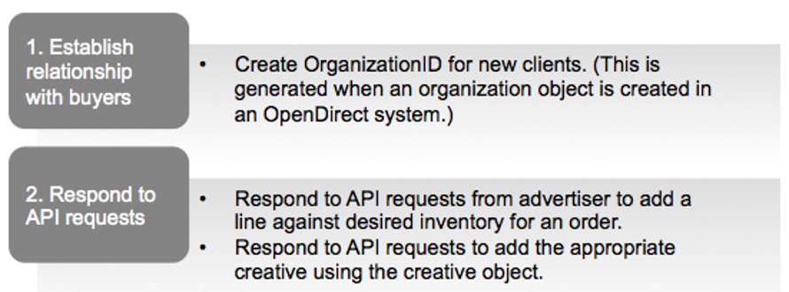

### 8.12.2 Agency and Advertiser Workflow Diagram

The following diagram outlines the workflow for creating an order.

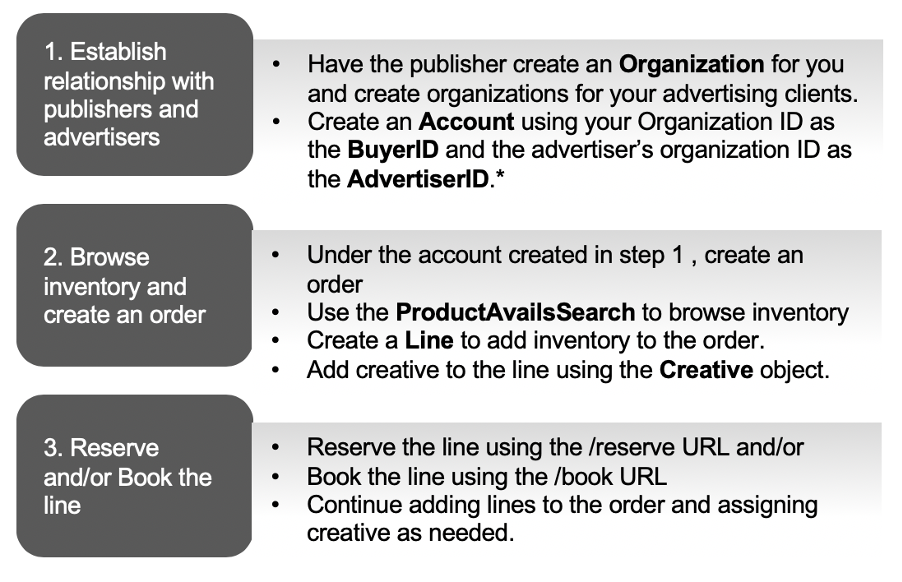

### 8.12.3 Booking State Diagram

The following diagram shows the state changes of a Line resource. For details about each state, see BookingStatus.

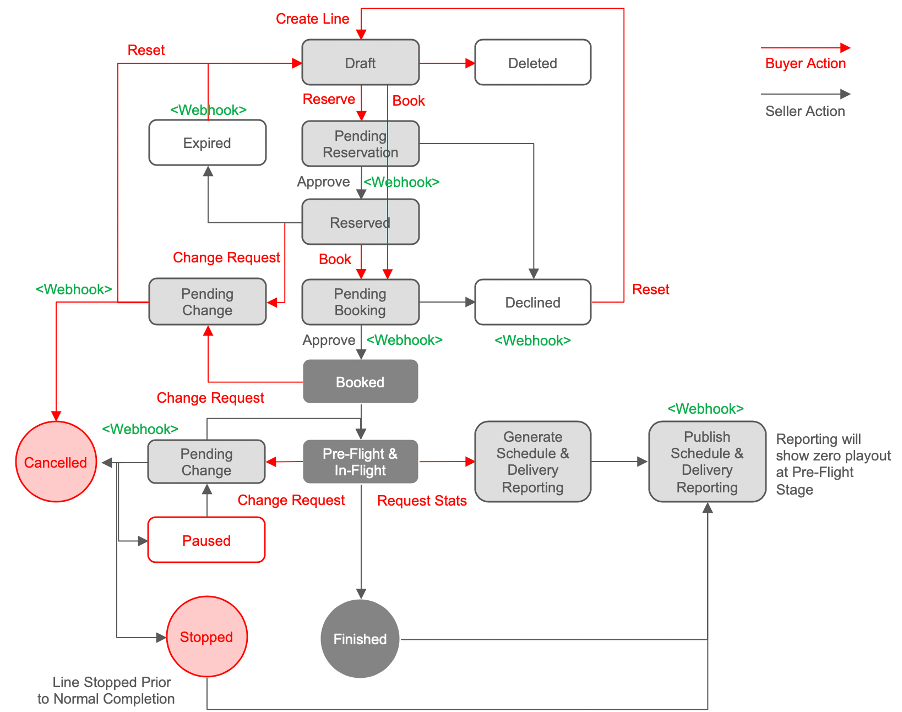

### 8.12.4 Resource Model Diagram

The following diagram shows the relationships between the OpenDirect resources. This model allows a buyer to work with many advertisers and an advertiser to work with many buyers. If the advertiser does their own buying, they&#39;d be both the advertiser and the buyer. For details about the resource objects, see Resources.

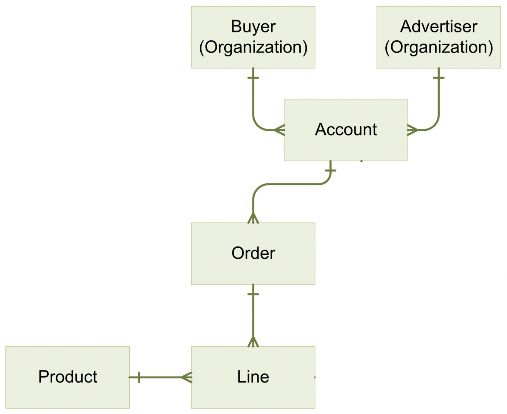

# Appendix A : Specification Change Log

This appendix serves as an index of specification changes. These changes pertain only to the substance of the specification and not routine document formatting, organization, or content without technical impact.

# Appendix B : Minimum OpenDirect (OOH) Resources &amp; Objects Required For An Initial Implementation

The OpenDirect (OOH) standard is designed to make an OOH Media Owner&#39;s existing trading tools and methods accessible to programmatic direct buyers.

The OpenDirect (OOH) standard is not about telling media owners how to trade, nor how to create key trading tools such as allocation and pricing engines.

The table below summarises the OpenDirect (OOH) Resources, Common Objects and Targeting OOHbjects required to achieve a basic implementation of OpenDirect (OOH) 1.5.1 based on a Media Owner&#39;s existing trading capabilities and trading tools.

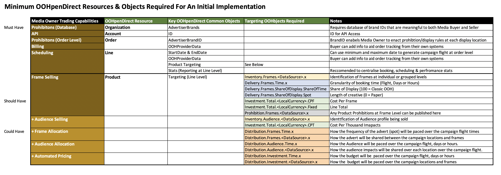

*OpenDirect 1.5.1 © 2016 Interactive Advertising Bureau, OpenDirect (OOH) 1.5.1 and OOHbjects © OutSmart and IPAO March 2020*
