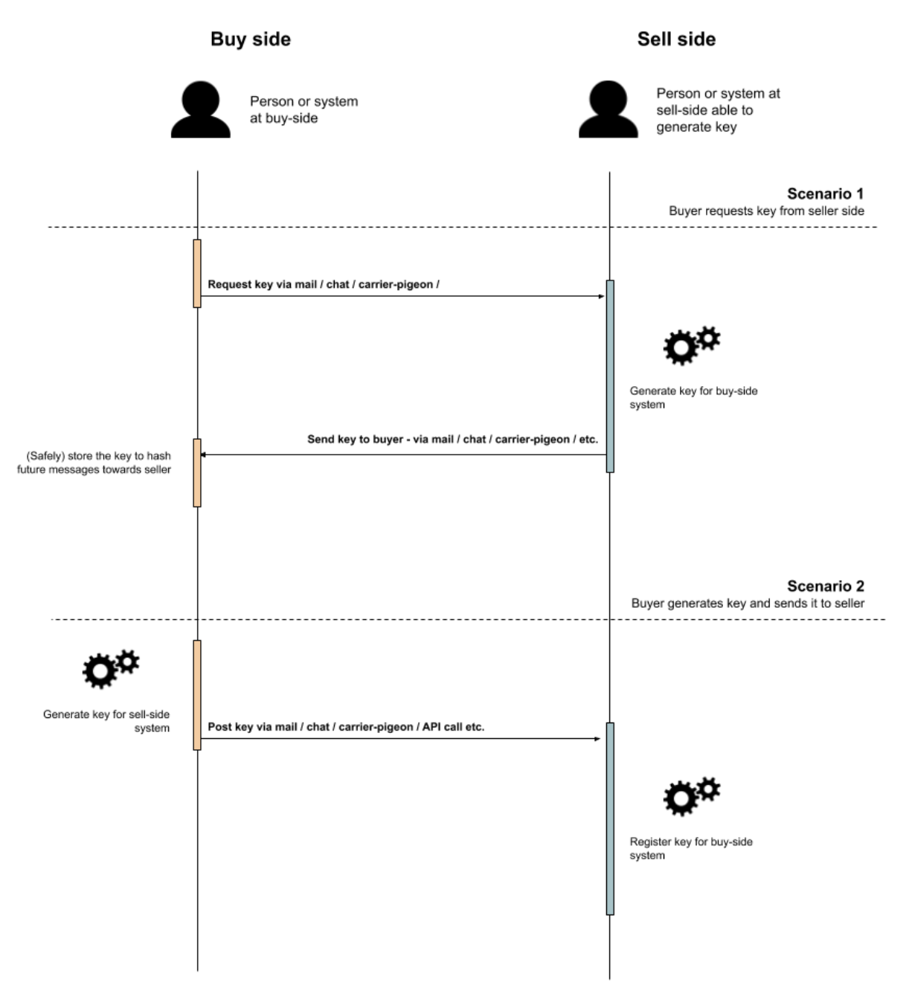
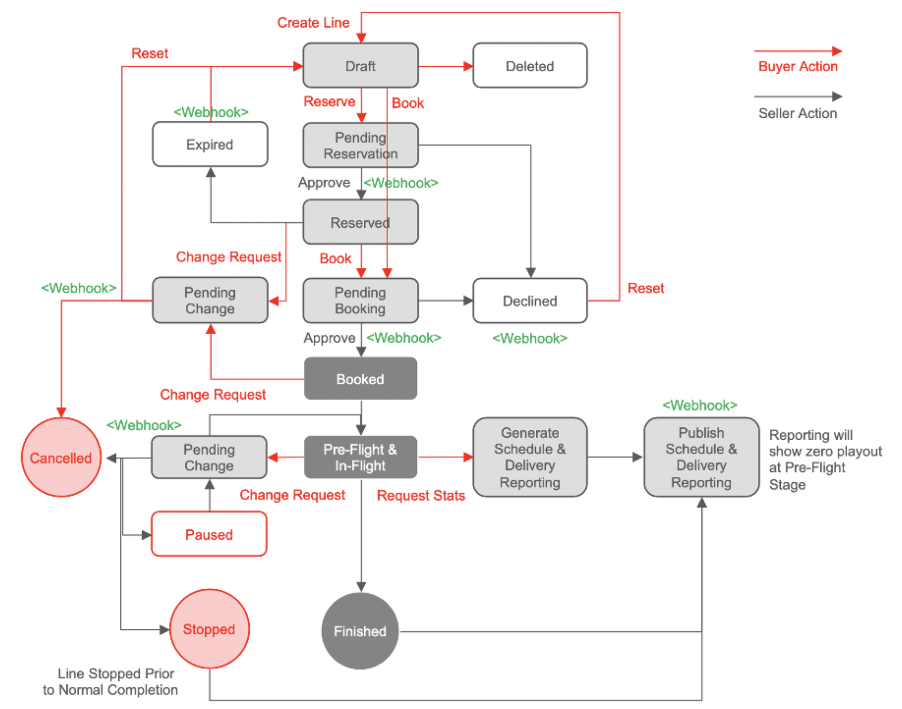
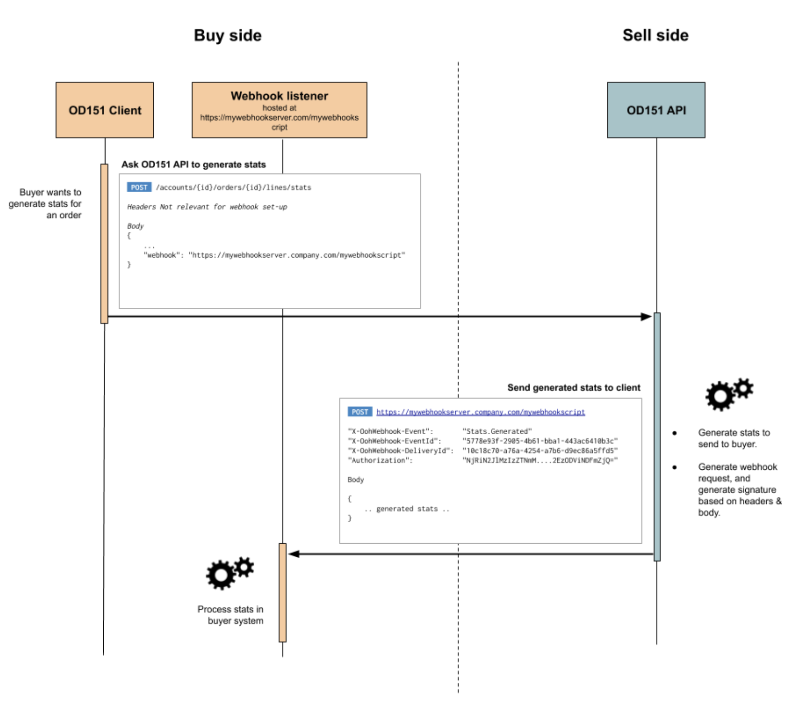

# **OpenDirect (OOH) Webhook Standardization**

**Version history**

| **Version** | **Date** | **Changes** |
| --- | --- | --- |
| v1.0 | Nov 12th, 2020 | First version describing how a webhook set-up should be standardized in an implementation of the OpenDirect (OOH) standard. All changes and versioning of this document will now be handled in Github |

## Table of Contents

[Introduction & Context](#introduction--context) 

[Process Summary](#process-summary) 

[Webhooks](#webhooks) 

[Anatomy of a webhook message](#anatomy-of-a-webhook-message) ([Headers](#headers) , [Events & Payloads](#events--payloads), [Example Message](#example-message) , [Body](#body) )

[Sending Webhook Messages](#sending-webhook-messages) ([Retry Mechanism](#retry-mechanism))

[Receiving messages](#receiving-messages) ([Returning the correct response code](#_x4ikkfd533rl))

[Securing Webhooks](#securing-webhooks) ([HMAC](#hmac),
[Canonicalized Headers](#canonicalized-headers),
[Registering The Shared Key](#registering-the-shared-key),
[Reccomendations](#recommendations),
[IP-Whitelisting](#ip-whitelisting))

## Introduction & Context

[The OOH OpenDirect standard](https://github.com/Outsmart-OOH/ooh_open_direct) suggests webhook feedback for several operations. This document describes how to set these up and how they should behave, thus standardizing implementation of webhooks in an implementation of [the OOH OpenDirect standard](https://github.com/Outsmart-OOH/ooh_open_direct).

This document is limited to anything that relates to platform & technology independent mechanisms, purely to facilitate easy, reliable, efficient and secure communication between two Open Direct v1.5.1 systems.

## Process Summary

The diagram below shows a summary flow of the webhook functional process in the form of a GET /stats request (Campaign Order Line upsite and performance report request)

## Webhooks

For asynchronous processing within the OpenDirect standard, webhooks offer a way to receive instant notifications on updates for any of these operations. Within the current OpenDirect (OOH) 1.5.1 standard, this is mostly needed for order line status changes and change requests, usually awaiting manual intervention.

Polling could be used as an alternative for the webhooks, and it&#39;s probably a good practice to always facilitate endpoints that would allow for polling, since there might be systems that are not able to implement webhooks for whatever reason, but also to get the latest version of any item in any moment in time by the connected systems.

The image below is taken from OpenDirect (OOH) 1.5.1 v1.1, and shows which state transitions require a webhook callback.

## Anatomy of a webhook message

### Headers

The application/json content type should be used for all messages.

Headers are also used to send meta-information about what kind of event is sent, if there are retries and security information.

| **Authorization** | HMAC-SHA512 signature of the message for sender authenticity verification |
| --- | --- |
| **X-OohWebhook-Event** | Name of the event, e.g. &#39;OrderLineStateChange&#39;. For now, this seems to also be the only event that needs to be supported. |
| **X-OohWebhook-MessageId** | A UUID for the event instance. Should be kept the same across redeliveries of the same event instance, see &#39;delivery id&#39; below. For each new webhook call that is not a retry, a new message-id should be generated. |
| **X-OohWebhook-DeliveryId** | A UUID for a single call to a webhook. This is useful to identify redeliveries of the same event instance (so having the same event-id), if supported &amp; enabled at the caller for the callee. |

### Events & Payloads

Events & payloads can be found throughout the OOH OpenDirect standard. The payload of webhook messages should be the same as their corresponding GET endpoints. All webhook supported messages need a corresponding GET endpoint to alsofacilitate long-polling and/or a manual refresh of information.

### Example message

_Headers_

&quot;Authorization&quot;:
 &quot;NjRiN2JlMzIzZTNmM2ZmZTRkZDMxNmMzMmYyNTI5MTAwNzkyZmFjMmNhODJmMGYyZjYxN2JmMTA5NzVjMmQwMzA1YzhhODI4MjYzNWU4OTA5YWNhMjMzYjg3YTNkYWE5ZTdiYzE5MTBiYTBjODRhYTE1YWFmM2EzODViNDFmZjQ=&quot;
 
&quot;X-OohWebhook-Event&quot;: &quot;OrderLine.ReservationConfirmed&quot;

&quot;X-OohWebhook-EventId&quot;: &quot;5778e93f-2905-4b61-bba1-443ac6410b3c&quot;

&quot;X-OohWebhook-DeliveryId&quot;: &quot;10c18c70-a76a-4254-a7b6-d9ec86a5ffd5&quot;

### Body

{

&quot;$schema&quot;: &quot;https://raw.githubusercontent.com/Outsmart-OOH/ooh\_open\_direct/master/schema/v1/uris/lines/lines\_response.json&quot;,

&quot;BookingStatus&quot;: &quot;Reserved&quot;,

&quot;StateChangeReason&quot;: &quot;&quot;,

&quot;Comment&quot;: &quot;Free form comment&quot;,

&quot;Cost&quot;: 8000,

&quot;EndDate&quot;: &quot;2014-12-10T18:00:00.000Z&quot;,

&quot;Id&quot;: &quot;345233&quot;,

&quot;Name&quot;: &quot;My Line 1&quot;,

&quot;OrderId&quot;: &quot;1235872&quot;,

&quot;ProductId&quot;: &quot;456366&quot;,

&quot;OOHProviderData&quot;: { &quot;PoNumber&quot;: &quot;88873&quot; } ,

&quot;StartDate&quot;: &quot;2014-12-05T06:00:00.000Z&quot;,

&quot;Targeting&quot;: [

 {

 &quot;Name&quot;: &quot;Inventory&quot;,

 &quot;Type&quot;: &quot;Frames&quot;,

 &quot;DataSource&quot;: &quot;Space&quot;,

 &quot;Target&quot;: &quot;frame\_id&quot;,

 &quot;TargetValues&quot;: [

  1234931339,

  1235190735,

  1234931338,

  1235191547

 ]

},

{

&quot;Name&quot;: &quot;Delivery&quot;,

&quot;Type&quot;: &quot;Frames&quot;,

&quot;DataSource&quot;: &quot;Time&quot;,

&quot;Target&quot;: &quot;Days&quot;,

&quot;TargetValues&quot;: [5, 6]

},

{

&quot;Name&quot;: &quot;Delivery&quot;,

&quot;Type&quot;: &quot;Frames&quot;,

&quot;DataSource&quot;: &quot;ShareOfDisplay&quot;,

&quot;Target&quot;: &quot;ShareOfTime&quot;,

&quot;TargetValues&quot;: [20]

},

{

&quot;Name&quot;: &quot;Delivery&quot;,

&quot;Type&quot;: &quot;Frames&quot;,

&quot;DataSource&quot;: &quot;ShareOfDisplay&quot;,

&quot;Target&quot;: &quot;Spot&quot;,

&quot;TargetValues&quot;: [5]

}

]

}

## Sending webhook messages

For a system offering a OpenDirect OOH API, the starting point is that for any message supporting webhook feedback, a URI is sent in the request body using the field &quot;webhook&quot;. When an event is triggered in the OpenDirect system supporting webhook feedback, it should send a message using the HTTP POST method to the webhook URI that was sent with the original request.

For each unique event, a unique message identifier should be generated to populate the &quot;X-OohWebhook-MessageId&quot; header, and the message needs to be signed as described in the &quot;Securing webhooks&quot; section.

The payload can be exactly the same as the payload that would normally send back in a direct response.

### Retry mechanism

In case of an error response or time-out, the caller should try to deliver the request multiple times. An error is assumed when the HTTP-response status code from the endpoint is not within the 2xx range, or when a time-out occurs. By default, the number of retries/redeliveries is 3 with an incremental time delay between them, e.g. 5 seconds, 30 seconds and 120 seconds. For each retry/redelivery a unique delivery UUID will be sent in the X-OohWebhook-DeliveryId HTTP header, to be able to separate different delivery attempts.

## Receiving messages

To receive a message as an OpenDirect client, the OpenDirect client needs to communicate a webhook URI to the OpenDirect server. A field for this called &quot;webhook&quot; is present on any request that facilitates this.

If a webhook URI is communicated, a message will be sent to that URI when an underlying resource has been updated. When the OpenDirect client receives a message, the first thing that needs to happen is to check the message authenticity by checking if the message was signed correctly, as outlined in &quot;Securing webhooks&quot;.

The next step should be to verify if the message hasn&#39;t already been processed. The X-OohWebhook-MessageId and X-OohWebhook-DeliveryId fields can be used to determine this. Both fields should probably be logged for each incoming request to be able to easily debug webhook message processing. Unique webhook events will have a unique message id, and should only be processed once. The delivery id can be used to discern different delivery attempts of the same message.

If the message is signed properly, and hasn&#39;t already been processed, the next step will be to actually process the message. To know what to do with the webhook request, the X-OohWebhook-Event HTTP header can be expected, to determine the type of the event. Based on this, the message can be processed according to the documentation that is set-up for each resource type in the OpenDirect OOH standard.

### Returning the correct response code

For the retry mechanism to properly function, a HTTP response code in the 200 range should be returned when the message is properly received. In most cases, it&#39;s probably best to return a 200 response code if the message is processed synchronously, and a 202 response code if the message is handled asynchronously, e.g. added to a queue to be processed later.

## Securing webhooks

Next to using HTTPS to encrypt the communication, additional security measures can be taken to properly secure the webhook calls.

### HMAC

HMAC is a way to verify if the message is coming from a trusted sender, and that its contents haven&#39;t been changed since it was sent. In order to be able to verify the sender of the incoming calls, a SecretKey in the form of a UUID must be shared between both the client and server systems. The SecretKey could either be provided by the organisation offering the API, or configured in a UI of the OD151 system by the client system organization.

Based on the request body (payload) and the shared SecretKey, an HMAC (hash-based message authentication code) signature should be generated by the calling system and provided in the &quot;Authorization&quot;HTTP header, using the SHA512 hash function.

The receiving system can validate the authenticity of the incoming message by using the SecretKey, the webhook headers and the body of the received message to generate a new HMAC, and compare it with the one provided from the calling system in order to ensure that it comes from a trusted sender.

The algorithm

The following algorithm should be used for computing the authorization signature:

_**sha512(**_

_ **secret-key,** _

_ **message-body + &quot;\n&quot; +** _

_ **canonicalized-ooh-webhook-headers** _

_**)**_

where:

- secret-key represents the secret key agreed upon by the buyer &amp; seller

- message- body represents the request message payload

- _ **canonicalized-ooh-webhook-headers** _represents the canonicalized headers

- **sha512** represents the hashing function-based message authentication code using the SHA512 cryptographic hashing algorithm and the secret key

### Canonicalized Headers

The webhook headers should be canonicalized, so that both buyer &amp; seller include in the same way when hashing the message. The headers should be canonicalized by:

- Lower-casing the header names,
- Sorting the headers ascending by name ascending,
- Removing any newlines (&#39;\n&#39;) in the header value,
- Separating each header headers by newlines (&#39;\n&#39;),
- Not adding any outer quotes in both keys and values.

_Example:_

_Given the message headers:_

_&quot;X-OohWebhook-DeliveryId&quot;: &quot;10c18c70-a76a-4254-a7b6-d9ec86a5ffd5&quot;_

_&quot;X-OohWebhook-Event&quot;: &quot;OrderLine.ReservationConfirmed&quot;_

_&quot;X-OohWebhook-EventId&quot;: &quot;5778e93f-2905-4b61-bba1-443ac6410b3c&quot;_

_And message body:_

_{&quot;myExampleKeyInJsonBody&quot;:&quot;myExampleValueInJsonBody&quot;}_

_The hash should be computed as follows:_

sha512 (

secretKey,

&quot;{\&quot;myExampleKeyInJsonBody&quot;:\&quot;myExampleValueInJsonBody\&quot;}}\nx-oohwebhook-deliveryid:10c18c70-a76a-4254-a7b6-d9ec86a5ffd5\nx-oohwebhook-event:OrderLine.ReservationConfirmed\nx-oohwebhook-eventid:5778e93f-2905-4b61-bba1-443ac6410b3c&quot;

)

### Registering the Shared Key

To be able to sign and verify messages using HMAC, we need a shared key. This key has to be generated once, and would probably be good to refresh it every couple of months or so. The shared key needed for HMAC signing, can be generated by either the buyer or the seller. They could be exchanged in an automated way by e.g. an API, but any secure way of exchanging the key will do.

### Recommendations

The shared cryptographic secret key should be different for each buyer.

### IP-whitelisting

Additionally, IP-whitelisting could be set-up to secure the webhook endpoints. Since this can be circumvented using IP-spoofing, it&#39;s recommended that it is used in combination with content signing using HMAC.
